# MIT Multivariable Calculus

###  Introduction

This article is the summary of Multivariable Calculus license.

### Dot Product

Because the dot product results in a scalar, it is also called the **scalar product**.

#### Algebraic View of Dot Product

Given two vectors $ \vec{a}=\left\langle a_{1}, a_{2}, a_{3}\right\rangle $, $ \vec{b}=\left\langle b_{1}, b_{2,} b_{3}\right\rangle $, their dot product is defined as following:
$$
\vec{a} \cdot \vec{b}=a_{1} b_{1}+a_{2} b_{2}+a_{3} b_{3}
$$

#### Properties of Dot Product

$$
\begin{array}{l}{\vec{u} \cdot(\vec{v}+\vec{w})=\vec{u} \cdot \vec{v}+\vec{u} \cdot \vec{w}} \\ {\vec{v} \cdot \vec{w}=\vec{w} \cdot \vec{v}} \\ {\vec{v} \cdot \vec{v}=\|\vec{v}\|^{2}}\end{array}
$$

$$
\begin{array}{l}{(c \vec{v}) \cdot \vec{w}=\vec{v} \cdot(c \vec{w})=c(\vec{v} \cdot
\vec{w})} \\ {\vec{v} \cdot \vec{0}=0} \\ {\text { If } \vec{v} \cdot \vec{v}=0 \text { then } \vec{v}=\vec{0}}\end{array}
$$

#### Geometric View of Dot Product

The following theorem can be proved by The Law of Cosines:
$$
\vec{a} \cdot \vec{b}=|\vec{a}||\vec{b}| \cos (\theta)
$$
This formula is usually not used to calculate the dot product, but to find the angle between the two vectors. With this formula, the dot product allows us to easily determine whether the two vectors are perpendicular or parallel.When two vectors are perpendicular to each other we say they are **orthogonal**.）

Now, if two vectors are orthogonal then we know that the angle between them is 90 degrees:
$$
\vec{a} \cdot \vec{b}=0
$$
Likewise, if two vectors are parallel then the angle between them is either 0 degrees (pointing in the same direction) or 180 degrees (pointing in the opposite direction):
$$
{c}{\vec{a} \cdot \vec{b}=|\vec{a}||\vec{b}|\quad(\theta=0{}^{\circ})} \\ {\vec{a} \cdot \vec{b}=-|\vec{a}||\vec{b}| \quad(\theta=180{}^{\circ})}
$$

#### Projections

The following two images are the projection of $\vec{b}$ onto $\vec{a}$, denoted by $ \operatorname{proj}_{\vec{a}} \vec{b} ​$

There is an nice formula for finding the projection of $\vec{b}​$ onto $\vec{a}​$. Here it is,
$$
\operatorname{proj}_{\vec{a}} \vec{b}=\frac{\vec{a} \cdot \vec{b}}{|\vec{a}|^{2}} \vec{a}
$$
Note that we also need to be very careful with notation here. The projection of $\vec{a}$ onto $\vec{b}$ is given by:
$$
\operatorname{proj}_{\vec{b}} \vec{a}=\frac{\vec{a} \cdot \vec{b}}{|\vec{b}|^{2}} \vec{b}
$$

### Cross Product

We should note that the cross product requires both of the vectors to be **three dimensional vectors**. The result of a dot product is a **number** and the result of a cross product is a **vector**!

#### Area and Determinants

We know that the formula in the dot product is $\cos \theta​$, and in the above figure is $\sin \theta​$, how do you convert them? The method in the figure below implements the conversion.Its main idea is as follows:

1. Rotate the vector $\vec{a}$ by $90^\circ$, so $\sin \theta=\cos \theta^{\prime}$
2. Since the above operation is rotation, the length of the vector $\vec{a}$ is unchanged.
3. By rotating, we get $\vec{A}^{\prime}​$, $\theta^{\prime}​$, $\vec{B}​$, and we can apply the dot product formula.

$$
\begin{align*}
|\vec{\mathbf{A}}||\vec{\mathbf{B}}| \sin (\theta)~ &=~|\vec{\mathbf{A^\prime}}||\vec{\mathbf{B}}| \cos (\theta^\prime)\\~ &=~
\vec{\mathbf{A^\prime}}\vec{\mathbf{B}}\\~ &=~
\left\langle- a_{2}, a_{1}\right\rangle \cdot\left\langle b_{1}, b_{2}\right\rangle\\~ &=~
a_{1} b_{2}-a_{2} b_{1}
\end{align*}
$$

The final result in the above picture is actually:
$$
a_{1} b_{2}-a_{2} b_{1}=\operatorname{det}(\vec{A}, \vec{B})=\left| \begin{array}{ll}{a_{1}} & {a_{2}} \\ {b_{1}} & {b_{2}}\end{array}\right|
$$
If you want to use determinant to find the area, you need to add an absolute notation, since the area is always positive. Another point is that the absolute value of the determinant is the area of the parallelogram, so the triangle should be multiplied by 1/2.

#### Definition of Cross Product

The definition of the cross product of two vectors is: 
$$
\vec{\mathbf{A}} \times \vec{\mathbf{B}}=\left| \begin{array}{ccc}{\mathbf{i}} & {\mathbf{j}} & {\mathbf{k}} \\ {a_{1}} & {a_{2}} & {a_{3}} \\ {b_{1}} & {b_{2}} & {b_{3}}\end{array}\right|=\left| \begin{array}{cc}{a_{2}} & {a_{3}} \\ {b_{2}} & {b_{3}}\end{array}\right| \mathbf{i}-\left| \begin{array}{cc}{a_{1}} & {a_{3}} \\ {b_{1}} & {b_{3}}\end{array}\right| \mathbf{j}
$$

There are 2 more knowledge points about cross product:

1. $\vec{A} \times \vec{B}=-(\vec{B} \times \vec{A})​$
2. $\vec{A} \times \vec{A}=0$

#### Volumes and Determinants

Volumes also can be obtained by determinants:

It’s $\vec{A} \cdot(\vec{B} \times \vec{C})=\operatorname{det}(\vec{A}, \vec{B}, \vec{C})​$ actually.

#### Equations of Planes

As shown in the figure below, three points on the plane are known, and the equation representing the plane is obtained. We already know that determinant can find the volume, and the volume of the plane is 0, so there is a formula in the figure below to find the plane equation.

The formula of a plane is: $a x+b y+c z=d$. When we know **the normal vector** of a plane, we can determine infinity parallel planes. If we give the plane through which point, we can Determine a specific plane.

#### Linear Systems and Planes

There are several possibilities for solutions to linear equations (assuming there are 3 planes):

1. no solution. The three planes are parallel, or the lines intersecting the two planes are parallel to the third plane (the third plane does not contain this line)
2. 1 solution. The line intersecting the two planes also intersects the third plane. The solution of $A X=B$ is $X=A^{-1} B$
3. Infinitely many solutions. 3 planes coincide, or the 3rd plane contains a line where 2 planes intersect

The following figure is an example of a solution:

### Total Differentials and the Chain Rule

The total differentials of $f(x, y, z)$:
$$
d f=f_{x} d x+f_{y} d y+f_{z} d z=\frac{\partial f}{\partial x} d x+\frac{\partial f}{\partial y} d y+\frac{\partial f}{\partial z} d z
$$
N.B. Be sure to distinguish between $d$ and $∂$, which represent total differential and partial differential, respectively. When you use partial differentiation, remember that it cannot be simplified, such as:

For total differentials, we have: $\frac{d f}{d x} \frac{d x}{d t}=\frac{d f}{d t}​$, but for partial differentiation, you can’t do this: $\frac{\partial f}{\partial x} \frac{\partial x}{\partial t} \neq \frac{\partial f}{\partial t}​$, $d f​$ isn’t $\Delta f​$, the total differential above can be explained by how infinitesimal changes in $x, y, z​$ affect $f​$, but Professor Denis Auroux prefers to interpret it as tangent approximation, $\Delta f \approx f_{x} \Delta x+f_{y} \Delta y+f_{z} \Delta z​$, when the $\Delta​$ variables tend to 0, approximate becomes equal.

The following 4 figures are more interesting examples about **the chain rule**:

Professor Denis Auroux gave us a better way to explain the picture labeled 15: $f​$ changes depending on the variables $x​$ and $y​$, and the changes in $x​$ and $y​$ depend on the variables $u​$ and $v​$, so when we want To find out the relationship between $f​$ and $u​$, i.e. $\frac{\partial f}{\partial u}​$, we can interpret it as a change in $u​$ affects the variables $x​$ and $y​$, and then changes in the variables $x​$ and $y​$ affect $f​$ , so there is a formula for the figure labeled 15.

In fact, the entire calculus discipline is a science that studies change, how the variables interact with each other, and how changes in one variable affect the change of another. We can also split the variables into the relationships of the variables we want to study. For example, we now know that $f$ is a function for $x$ and $y$, and the variable $t$ affects variables $x$ and $y$, so we can split $x$ and $y$ as the function of the variable $t$ to study the relationship between $f$ and $t$.

### Gradient and directional derivative

#### Velocity, Speed and Arc Length

We use $ \vec{r}(t)=x(t) \vec{i}+y(t) \vec{j}=\langle x, y\rangle ​$ to trace the curve trace in the figure above, if the starting point is at the origin, then it’s a position vector. We use s as arc length. The figure above is an example of a two-dimensional space, and the three dimensional space is the same, except that one dimension is added. From the figure above, we have:
$$
\Delta s \approx|\vec{\Delta r}|=\sqrt{(\Delta x)^{2}+(\Delta y)^{2}}
$$
We divide the above 2 sides by $\Delta$ to get:
$$
\frac{\Delta s}{\Delta t} \approx\left|\frac{\vec{\Delta r}}{\Delta t}\right|=\sqrt{\left(\frac{\Delta x}{\Delta t}\right)^{2}+\left(\frac{\Delta y}{\Delta t}\right)^{2}}
$$
Taking the limit as $\Delta t \rightarrow 0$ gives:
$$
\frac{d s}{d t}=\left|\frac{\vec{d r}}{d t}\right|=\sqrt{\left(\frac{d x}{d t}\right)^{2}+\left(\frac{d y}{d t}\right)^{2}}=|\vec{v}|=s p e e d
$$
In the above formula, we get the speed, we can see that it has only size, no direction, that is, scalar. The formula for velocity is: 
$$
\frac{d s}{d t}=\left|\frac{\vec{d r}}{d t}\right|=\sqrt{\left(\frac{d x}{d t}\right)^{2}+\left(\frac{d y}{d t}\right)^{2}}=|\vec{v}|=speed
$$
Velocity is a vector, a tangent vector that is tangent to the trajectory at all times.

The **unit tangent vector** is a unit vector in the same direction as the tangent vector. We usually denote it $\vec{T}​$. We compute it by dividing the tangent vector by its length. Here are several ways of writing this.

#### Gradient

The following is a very important theorem:

> Gradients are orthogonal to level curves and level surfaces.

The definition of the level surface is as follows:

> A level surface, or level set of a function of three variables, f (x, y, z), is a surface of the form f (x, y, z) = c, where c is a constant. The. function f can be represented by the family of level surfaces obtained. by allowing c to vary.

Assume function $w=w(x, y, z)$, and $x=x(t), y=y(t), z=z(t)$, According to the chain rule:
$$
\frac{d w}{d t}=w_{x} \frac{d x}{d t}+w_{y} \frac{d y}{d t}+w_{z} \frac{d z}{d t}=\nabla W \cdot \frac{d \vec{r}}{d t}
$$
Among them:
$$
\begin{array}{c}{\nabla w=\left\langle w_{x}, w_{y}, w_{z}\right\rangle} \\ {\frac{d \vec{r}}{d t}=\left\langle\frac{d x}{d t}, \frac{d y}{d t}, \frac{d z}{d t}\right\rangle}\end{array}
$$
$\nabla w$ is the so-called **gradient**, Since the value of the function on level surfaces does not change:

##### Find Tangent Plane

Using the above theorem, we can find out tangent plane easily, such that:

> Find the tangent plane of $x^{2}+y^{2}-z^{2}=4​$ at $(2,1,1)​$.

The contour plot of this function is as follows:

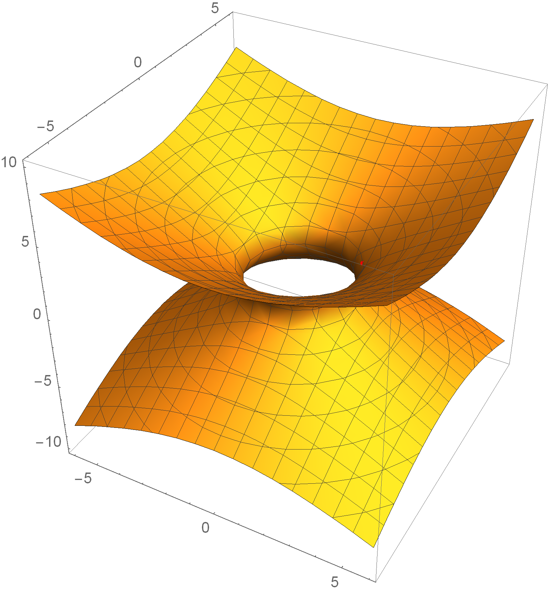
$$
\nabla w=\left\langle\frac{\partial w}{\partial x}, \frac{\partial w}{\partial y}, \frac{\partial w}{\partial z}\right\rangle=\langle 2 x, 2 y,-2 z\rangle\\
\nabla w(2,1,1)=\langle 4,2,-2\rangle
$$
The normal vector of the tangent plane is $\langle 4,2,-2\rangle$, so the tangent plane is:
$$
4 x+2 y-2 z=C=8
$$
i.e. $2 x+ y- z=4​$, as the following figure:

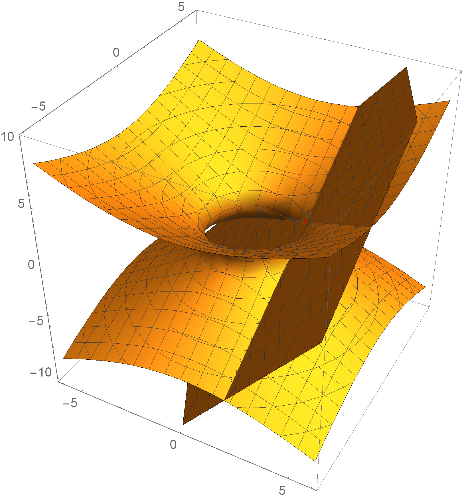

#### Directional Derivatives

The Partial derivative $w_x​$ and $w_y​$ of $w = w(x, y)​$ measure the change in $w​$ when the point moves on the $x​$ and $y​$ axes, so what if it moves in the other direction? Is there a derivative in any direction? The answer is yes, that is the direction derivative. The directional derivative is the slope of the vertical plane cut line in that direction in a certain direction.

If moving at a unit speed in the direction of $\vec{u}$, let $s$ be the distance of motion, and the trajectory vector r is the trajectory of the point motion, because it is a straight line, so $s = |r|$. Now let the trajectory vector r be a function of the motion distance, $r = r(s)$, then the rate of change of $r$ is the unit vector $\vec{u}$, which is the derivative of $r$: $\frac{dr}{ds} = \vec{u}$.

The thing we really care is the Rate of change of $w​$:
$$
\left.\frac{d w}{d s}\right|_{\vec{u}}=\frac{d w}{d \vec{r}} \cdot \frac{d \vec{r}}{d s}=\nabla w \cdot \frac{d \hat{r}}{d s}=\nabla w \cdot \vec{u}
$$

> The direction of the gradient is the direction in which the value of w is increased the fastest at a given point.

$$
\begin{align}
\left.\frac{d w}{d s}\right|_{\hat{\mathbf{u}}}=\boldsymbol{\nabla} w \cdot \hat{\mathbf{u}}=|\nabla w||\hat{\mathbf{u}}| \cos \theta\\
\end{align}
$$

Maximal when $\cos \theta=1​$, hence $\hat{\mathbf{u}}=\operatorname{dir}(\boldsymbol{\nabla} w)​$

### Lagrange Multipliers

Lagrange multipliers is used for solving optimization problems with constraints condition. 

We want to optimize (i.e. find the minimum and maximum value of) a function, $f(x,y,z)$, subject to the constraint $g(x,y,z)=k$. Again, the constraint may be the equation that describes the boundary of a region or it may not be. 

1. Solve the following system of equations:
   $$
   \begin{aligned} \nabla f(x, y, z) &=\lambda \nabla g(x, y, z) \\ g(x, y, z) &=k \end{aligned}
   $$

2. Plug in all solutions $(x,y,z)​$, from the first step into $f(x,y,z)​$ and identify the minimum and maximum values, provided they exist.

The constant $\lambda$ is called the **Lagrange Multiplier**

Here we will give two arguments, one geometric and one analytic for why Lagrange multipliers work.

#### Analytic proof for Lagrange

Suppose $f$ has a local maximum at $P$ on the constraint surface.

Let $\mathbf{r}(t)=\langle x(t), y(t), z(t)\rangle$ be an arbitrary parametrized curve which lies on the constraint surface and has $(x(0), y(0), z(0))=P$. Finally, let $h(t)=f(x(t), y(t), z(t))$. The setup
guarantees that $h(t)$ has a maximum at $t = 0$.

Taking a derivative using the chain rule in vector form gives:
$$
h^{\prime}(t)=\nabla\left.f\right|_{r(t)} \cdot r^{\prime}(t)
$$
Since $t=0$ is a local maximum, we have:
$$
h^{\prime}(0)=\nabla\left.f\right|_{P} \cdot r^{\prime}(0)=0
$$
Thus, $\nabla\left.f\right|_{P}​$ is perpendicular to any curve on the constraint surface through $P​$. This implies $\nabla\left.f\right|_{P}​$ is perpendicular to the surface. Since $\nabla\left.g\right|_{P}​$ is also perpendicular to the surface we have proved $\nabla\left.g\right|_{P}​$ is parallel to $\nabla\left.f\right|_{P}​$.

#### Geometric proof for Lagrange

For concreteness, we’ve drawn the constraint curve, g(x, y)= c, as a circle and some level curves for $w = f(x, y)= \frac{x^2}{10}+y^2=c​$ with $c=\{0.5,1.,1.5,2.,2.5,3.,3.5,4.\}​$. Geometrically, we are looking $f​$ or the point on the circle where w takes its maximum or minimum values.

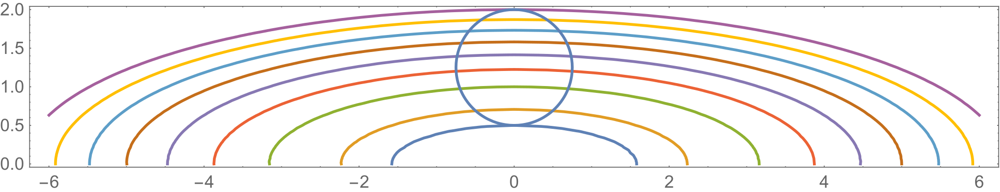

Since the circle is a level curve for $g$, we know $\nabla g$ is perpendicular to it. We also know $\nabla g$ is perpendicular to the level, since the curves themselves are tangent, these two gradients must be parallel.

### Non-independent Variable

If there is a function $g(x, y, z) = C$ containing three dependent variables, in theory each variable can be represented by two other variables, such as $z$ with $x$, $y$ for: $z = z(x, y)$, so that you can more clearly know the relationship between $z$ and $x$, $y$, that is, how $x$ and $y$ affects $z$ when $x$ and $y$ changes. However, in most cases, finding $z(x,y)$ is difficult. How should you understand the relationship between variables? That is, what is the rate of change of $z$ in $z = z(x, y)$? See a example as follows:

#### Example of Non-independent Variable

There is a relationship $g(x, y, z)=x^{2}+y z+z^{3}=8​$, observed near the point $(x, y, z) = (2, 3, 1)​$, how $z​$ change when $x​$ and $y​$ change minorly?

Firstly, the total differential of $g$ is:
$$
d g=\frac{\partial g}{\partial x} d x+\frac{\partial g}{\partial y} d y+\frac{\partial g}{\partial z} d z=2 x d x+z d y+\left(y+3 z^{2}\right) d z=0
$$
At he point $(x, y, z) = (2, 3, 1)$:
$$
d\left.g\right|_{(2,3,1)}=4 d x+d y+6 d z=0
$$
Look at $z$ as a function about$x,y$:
$$
d z=-\frac{4 d x+d y}{6}=-\frac{2 d x}{3}-\frac{d y}{6}
$$
Hence:
$$
\begin{aligned}
\frac{\partial z}{\partial x}=-\frac{2}{3}\\
\frac{\partial z}{\partial y}=-\frac{1}{6}
\end{aligned}
$$
In general, if $g(x,y,z)=C$, then:
$$
d g=g_{x} d x+g_{y} d y+g_{z} d z=0
$$
Thus the differential of any variable can be represented by other variables, such as changes in z:
$$
d z=-\frac{g_{x}}{g_{z}} d x-\frac{g_{y}}{g_{z}} d y
$$
which can lead to:
$$
\frac{\partial z}{\partial y}=-\frac{g_{y}}{g_{z}}\\
\frac{\partial z}{\partial x}=-\frac{g_{x}}{g_{z}}
$$
Now, we use the new notation to clearly indicate which is constant:
$$
{\left(\frac{\partial f}{\partial x}\right)_{y} \text { means keep } y \text { constant }} \\ {\left(\frac{\partial f}{\partial u}\right)_{v} \text { means keep } v \text { constant }} \\ {\text { so }\left(\frac{\partial f}{\partial x}\right)_{y} \neq\left(\frac{\partial f}{\partial x}\right)_{v}=\left(\frac{\partial f}{\partial u}\right)_{v}}
$$

#### Example: Area of Triangle

The Area is a function of $a,b,\theta$:
$$
A=\frac{1}{2} a b \sin \theta
$$
Assume it’s a right triangle, thus $a=b\cos \theta​$

The rate of change of Area when $a$ keep unchanged and $b$ changed:
$$
\begin{aligned} A &=\frac{1}{2} a b \sin \theta \\ d A &=\frac{\partial A}{\partial a} d a+\frac{\partial A}{\partial b} d b+\frac{\partial A}{\partial \theta} d \theta \\ &=\frac{1}{2} b \sin \theta d a+\frac{1}{2} a \sin \theta d b+\frac{1}{2} a b \cos \theta d \theta \end{aligned}
$$
Since $a$ keep unchanged, $d a=0​$
$$
\begin{aligned} d A&=0+\frac{1}{2} \operatorname{a\sin} \theta(b \tan \theta d \theta)+\frac{1}{2} a b \cos \theta d \theta \\ &=\frac{1}{2} a b(\sin \theta \tan \theta+\cos \theta) d \theta \\ &=\frac{1}{2} a b\left(\frac{\sin ^{2} \theta}{\cos \theta}+\frac{\cos ^{2} \theta}{\cos \theta}\right) d \theta \\ &=\frac{1}{2} a b\left(\frac{1}{\cos \theta}\right) d \theta \\ &=\frac{1}{2} a b \sec \theta d \theta \end{aligned}
$$
Hence:
$$
\frac{d A}{d \theta}=\left(\frac{\partial A}{\partial \theta}\right)_{a}=\frac{1}{2} a b \sec \theta
$$

### Double Integrals

#### Volume

Double integral can be used to calculate the volume:
$$
Volume  =\iint_{R} f(x, y) d A
$$
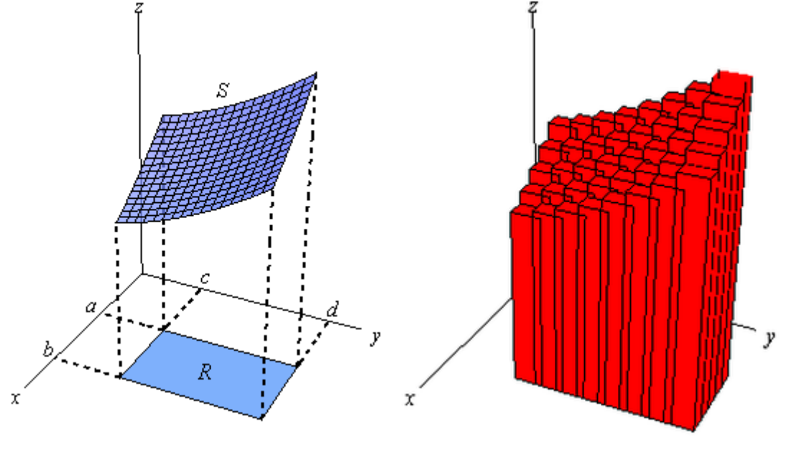
The above formula is one of the most succinct and abstract ways, we have two specific ways of thinking:

1. Imagine a plane parallel to the $y$ and $z$ axes, swept along the $x$ axis, so we have the following formula. In fact, the formula inside the brackets indicates the area of the slices, and after $dx$ is a small volume, then Integrate along the $x$ axis:
   $$
   \int_{a}^{b}\left[\int_{c}^{d} f(x, y) d y\right] d x
   $$

2. Similarly:
   $$
   \int_{c}^{d}\left[\int_{a}^{b} f(x, y) d x\right] d y
   $$

The two formula above are also called as **iterated integrals**, in a word:
$$
Volumn=\iint_{R} f(x, y) d A=\int_{c}^{d} \int_{a}^{b} f(x, y) d x d y=\int_{c}^{d} \int_{a}^{b} f(x, y) d x d y
$$
Let me explain the problem of the integral boundary in the above formula. It is also divided into two kinds of situations:

##### Rectangular area

As shown in the figure below, when you slice the variable $x$, the range of the variable $y$ does not change with the change of the variable $x$; the same reason, when you slice the variable $y$, the range of the variable $x$ does not change with the variable $y$. Variety. So in this case, the order of exchanging the points is very simple.

$$
\int_{0}^{1} \int_{0}^{2} d x d y=\int_{0}^{2} \int_{0}^{1} d y d x
$$

##### Arbitrarily shaped area

As you can see in the figure below, when you slice the variable $x$, the range of the variable $y$ changes with the value of the variable $x$. By the same token, when you slice the variable $y$, the range of the variable $x$ is also taken along with the variable $y$. Change in value. So in this case, the order of exchanging points becomes complicated.
$$
\int_{0}^{1} \int_{x}^{\sqrt{x}} \frac{e^{y}}{y} d y d x=?
$$
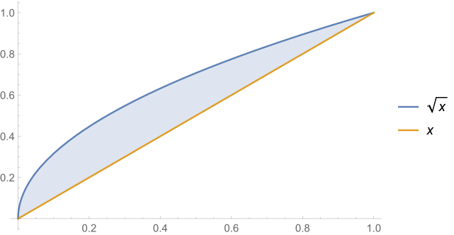
$$
\begin{aligned}
\int_{0}^{1} \int_{x}^{\sqrt{x}} \frac{e^{y}}{y} d y d x&=\int_{0}^{1} \int_{x_{\max }(y)}^{x_{\max }(y)} \frac{e^{y}}{y} d x d y\\
&=\int_{0}^{1} \int_{y^{2}}^{y} \frac{e^{y}}{y} d x d y\\
&=\int_{0}^{1} \frac{e^{y}}{y}\left.x\right|_{y^{2}} ^{y}d y\\
&=\int_{0}^{1} (e^{y}-y e^{y})d y\\
&={\int_{0}^{1}-\left(e^{y}+y e^{y}-2 e^{y}\right) d y} \\ 
&=-\left(\int_{0}^{1}\left(e^{y}+y e^{y}\right) d y-\int_{0}^{1} 2 e^{y} d y\right) \\ 
&=-\left.\left(y e^{y}-2 e^{y}\right)\right|_{0} ^{1} \\ 
&=e-2
\end{aligned}
$$

#### Double Integrals in Polar Coordinates

Look at such an example:

> $\int_{0}^{1} \int_{0}^{\sqrt{1-x^{2}}}\left(1-x^{2}-y^{2}\right) d y d x​$

Firstly, calculate the inner integral:
$$
\begin{aligned} \int_{0}^{\sqrt{1-x^{2}}}\left(1-x^{2}-y^{2}\right) d y &=\left.\left(y-x^{2} y-\frac{y^{3}}{3}\right)\right|_{0} ^{\sqrt{1-x^{2}}} \\ &=\left.\left(\left(1-x^{2}\right) y-\frac{y^{3}}{3}\right)\right|_{0} ^{\left(1-x^{2}\right)^{1 / 2}} \\ &=\left(\left(1-x^{2}\right)\left(1-x^{2}\right)^{1 / 2}-\frac{\left(1-x^{2}\right)^{3 / 2}}{3}\right)-0 \\ &=\frac{2}{3}\left(1-x^{2}\right)^{3 / 2} \end{aligned}
$$
Then calculate the following integral:
$$
\begin{aligned} \int \frac{2}{3}\left(1-x^{2}\right)^{3 / 2} d x &=\frac{2}{3} \int\left(1-\sin ^{2} \theta\right)^{3 / 2} \cos \theta d \theta \\ &=\frac{2}{3} \int\left(\cos ^{2} \theta\right)^{3 / 2} \cos \theta d \theta \\ &=\frac{2}{3} \int \cos ^{4} \theta d \theta \\ &=\frac{2}{3} \int\left(\frac{1+\cos 2 \theta}{2}\right)^{2} d \theta \\ &=\frac{2}{3} \int\left(\frac{1}{4}+\frac{\cos 2 \theta}{2}+\frac{\cos ^{2} 2 \theta}{4}\right) d \theta\\ 
&=\frac{2}{3}\left(\frac{\theta}{4}+\frac{\sin 2 \theta}{4}+\frac{1}{4}\left(\int \frac{1}{2} d \theta+\int \frac{\cos 4 \theta}{2} d \theta\right)\right) \\ 
&=\frac{2}{3}\left(\frac{\theta}{4}+\frac{\sin 2 \theta}{2}+\frac{1}{4}\left(\frac{\theta}{2}+\frac{\sin 4 \theta}{8}\right)\right)+C \\
&=\frac{\theta}{4}+\frac{2}{3}\left(\frac{\sin 2 \theta}{2}+\frac{\sin 4 \theta}{32}\right)+\mathrm{C}
\end{aligned}
$$

$$
\begin{aligned}  
\int_{0}^{1} \frac{2}{3}\left(1-x^{2}\right)^{3 / 2} d x=\int_{0}^{\pi / 2}\left(\frac{\theta}{4}+\frac{2}{3}\left(\frac{\sin 2 \theta}{2}+\frac{\sin 4 \theta}{32}\right)\right) d \theta=\frac{\pi}{8}
\end{aligned}
$$

Although this method do work, but the process of calculating the integral is very cumbersome, so we convert this problem to polar coordinates:

Convert variables $x,y$ to $r,\theta$:
$$
\begin{aligned}
x&=r\cos\theta\\
y&=r\sin\theta\\
d A&=r\ d rd\theta
\end{aligned}
$$
Hence:
$$
\begin{aligned} f &=1-x^{2}-y^{2} \\ &=1-\left(x^{2}+y^{2}\right) \\ &=1-r^{2} \end{aligned}
$$
That is:
$$
\int_{0}^{1} \int_{0}^{\sqrt{1-x^{2}}}\left(1-x^{2}-y^{2}\right) d y d x=\int_{0}^{\frac{\pi}{2}} \int_{0}^{1}r\left(1-r^{2}\right)d r d \theta
$$

#### Change of Variables

The reasons for transforming variables are given below:

While often the reason for changing variables is to **get us an integral that we can do** with the new variables, another reason for changing variables is to **convert the region into a nicer region** to work with.

If the variable in the integrand $f(x, y)​$ of the binary integral is replaced by $u = u(x, y), v = v(x, y)​$, then a small change in $u​$ and $v​$ is a light perturbation by the combined results of x and y:

$$
\begin{array}{l}{\Delta u \approx \frac{\partial u}{\partial x} \Delta x+\frac{\partial u}{\partial y} \Delta y} \\ {\Delta v \approx \frac{\partial v}{\partial x} \Delta x+\frac{\partial v}{\partial y} \Delta y}\end{array}
$$
If represented the above result by a matrix:
$$
\left[ \begin{array}{l}{\Delta u} \\ {\Delta v}\end{array}\right]=\left[ \begin{array}{ll}{u_{x}} & {u_{y}} \\ {v_{x}} & {v_{y}}\end{array}\right] \left[ \begin{array}{l}{\Delta x} \\ {\Delta y}\end{array}\right]
$$
This actually shows that, for a linear transformation, the small rectangle will be converted to a parallelogram, and the scaling ratio of the area is the determinant of the partial derivative. If $A = \Delta x\Delta y​$ is a rectangle with a vertex at the origin:
$$
\begin{array}{l}
{\langle\Delta x, 0\rangle\longrightarrow\langle\Delta u, \Delta v\rangle \approx\left\langle u_{x} \Delta x, v_{x} \Delta x\right\rangle} \\
{\langle 0, \Delta y\rangle\longrightarrow\langle\Delta u, \Delta v\rangle \approx\left\langle u_{y} \Delta y, v_{y} \Delta y\right\rangle}
\end{array}
$$

$$
A^{\prime}=\left\langle u_{x} \Delta x, v_{x} \Delta x\right\rangle \times\left\langle u_{y} \Delta y, v_{y} \Delta y\right\rangle=\left| \begin{array}{ll}{ u_{x}} & {v_{x}} \\ {u_{y}} & {v_{y}}\end{array}\right| \Delta x \Delta y=\left| \begin{array}{ll}{u_{x}} & {u_{y}} \\ {v_{x}} & {v_{y}}\end{array}\right| \Delta x \Delta y
$$

This determinant is called as Jacobian determinant, expressed by mathematical symbols :
$$
\begin{aligned} J&=\frac{\partial(u, v)}{\partial(x, y)} =\left| \begin{array}{ll}{u_{x}} & {u_{y}} \\ {v_{x}} & {v_{y}}\end{array}\right| \\ d u d v &=|J| d x d y=\left|\frac{\partial(u, v)}{\partial(x, y)}\right| d x d y \end{aligned}
$$

### Vector Field

Each point on a two-dimensional plane corresponded to a vector can be represented as follows:
$$
\vec{F}=M \hat{\imath}+N \hat{\jmath}
$$
In this formula, $\vec{i}$ and $\vec{j}$ are unit vectors, $M$ and $F$ are function about $x$ and $y$. Just like the following figure: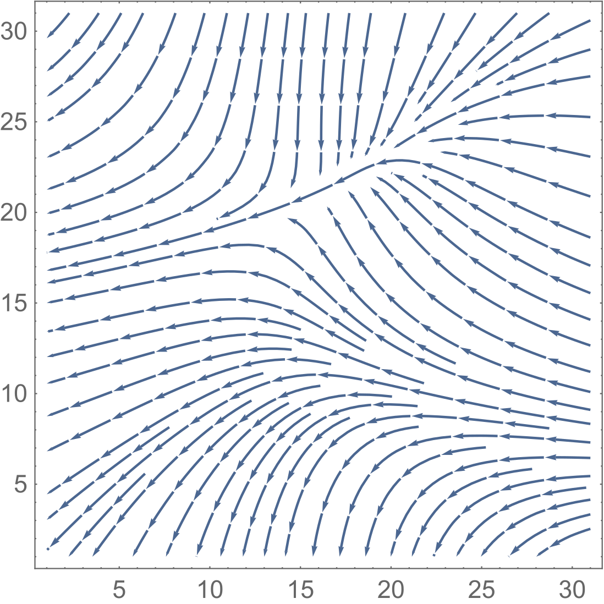

### Line Integrals

#### Line Integrals with Respect to Arc Length

The integral of curve length is trivial:
$$
L=\int_{a}^{b} d s
$$
Among them:
$$
d s=\sqrt{(d x)^{2}+(d y)^{2}}=\sqrt{\left(\frac{d x}{d t}\right)^{2}+\left(\frac{d y}{d t}\right)^{2}}
$$
According to this we have a line integral to the arc length, its basic form is as follows:
$$
\int_{C} f(x, y) d s
$$

|                            Curve                             |                   **Parametric Equations**                   |
| :----------------------------------------------------------: | :----------------------------------------------------------: |
| $\begin{array}{c} \displaystyle \frac{{{x^2}}}{{{a^2}}} + \frac{{{y^2}}}{{{b^2}}} = 1 \\ \mbox{(Ellipse)}\end{array}$ | $\begin{array}{c} \begin{array}{c}\mbox{Counter-Clockwise} \\x = a\cos \left( t \right)\\ y = b\sin \left( t \right)\\ 0 \le t \le 2\pi \end{array}& \begin{array}{c} \mbox{Clockwise} \\x = a\cos \left( t \right)\\ y =  - b\sin \left( t \right)\\ 0 \le t \le 2\pi \end{array} \end{array}$ |
| $\begin{array}{c}{x^2} + {y^2} = {r^2} \\ \mbox{(Circle)}\end{array}$ | $\begin{array}{c} \begin{array}{c}\mbox{Counter-Clockwise} \\ x = r\cos \left( t \right)\\ y = r\sin \left( t \right)\\ 0 \le t \le 2\pi \end{array} & \begin{array}{c} \mbox{Clockwise} \\  x = r\cos \left( t \right)\\  y =  - r\sin \left( t \right)\\  0 \le t \le 2\pi \end{array} \end{array}$ |
|                   $y = f\left( x \right)$                    |        $\begin{array}{l}{x=t} \\ {y=f(t)}\end{array}$        |
|                           $x=g(y)$                           | $\begin{align*}x & = g\left( t \right)\\ y & = t\end{align*}$ |
| $\begin{array}{l}\mbox{Line Segment From} \\ \left( {{x_0},{y_0},{z_0}} \right)  \mbox{ to}  \\ \left( {{x_1},{y_1},{z_1}} \right) \end{array}$ | $\begin{array}{c} \vec r\left( t \right) = \left( {1 - t} \right)\left\langle {{x_0},{y_0},{z_0}} \right\rangle  + t\left\langle {{x_1},{y_1},{z_1}} \right\rangle \,\,\,,\,\,0 \le t \le 1 \\ \mbox{or} \\ \begin{array}{l} \begin{aligned} x & = \left( {1 - t} \right){x_0} + t\,{x_1}\\ y & = \left( {1 - t} \right){y_0} + t\,{y_1}\\ z & = \left( {1 - t} \right){z_0} + t\,{z_1} \end{aligned} & , \,\,\,\,\,\, 0 \le t \le 1 \end{array} \end{array}$ |

For piecewise smooth cure(like following figure), its calculation is also very simple, is to accumulate the integrals of the various parts, the formula is as follows:
$$
\int_{C} f(x, y) d s=\int_{C_{1}} f(x, y) d s+\int_{C_{2}} f(x, y) d s+\int_{C_{3}} f(x, y) d s+\int_{C_{4}} f(x, y) d s
$$
  

There are two properties about this type of curve integral: 

1. **Not Path-independence**. The starting point is the same, but the integral path is different, which will result in different integration results. 
2. On the same integration path, the integration direction will not affect the integration result.

#### Line Integrals with Respect to $x$, $y$, and/or $z$

The line integral of f with respect to x is:
$$
\int_{C} f(x,y)dx
$$
The line integral of f with respect to x is:
$$
\int_{C} f(x,y)dy
$$
As can be seen from the above definition, the only difference between it and the line integral for the arc length is **differential**. The above two types of points often appear together, so they are usually represented by the following notation:
$$
\int_{C} P(x,y)dx+\int_{C} Q(x,y)dy=\int_{C} Pdx+Qdy
$$

For this type of integral, the opposite direction of the integration will result in the opposite result of the integration:
$$
\int_{C} f(x,y)dx=-\int_{-C} f(x,y)dx \\ \int_{C} f(x,y)dy=-\int_{-C} f(x,y)dy\\ \int_{C} Pdx+Qdy=-\int_{-C} Pdx+Qdy
$$

#### Line Integrals of Vector Fields

In physics, the work done by force at a sufficiently small distance is equal to the dot product of the force vector and the displacement vector.
$$
W=\vec{F} \cdot \vec{\Delta r}
$$
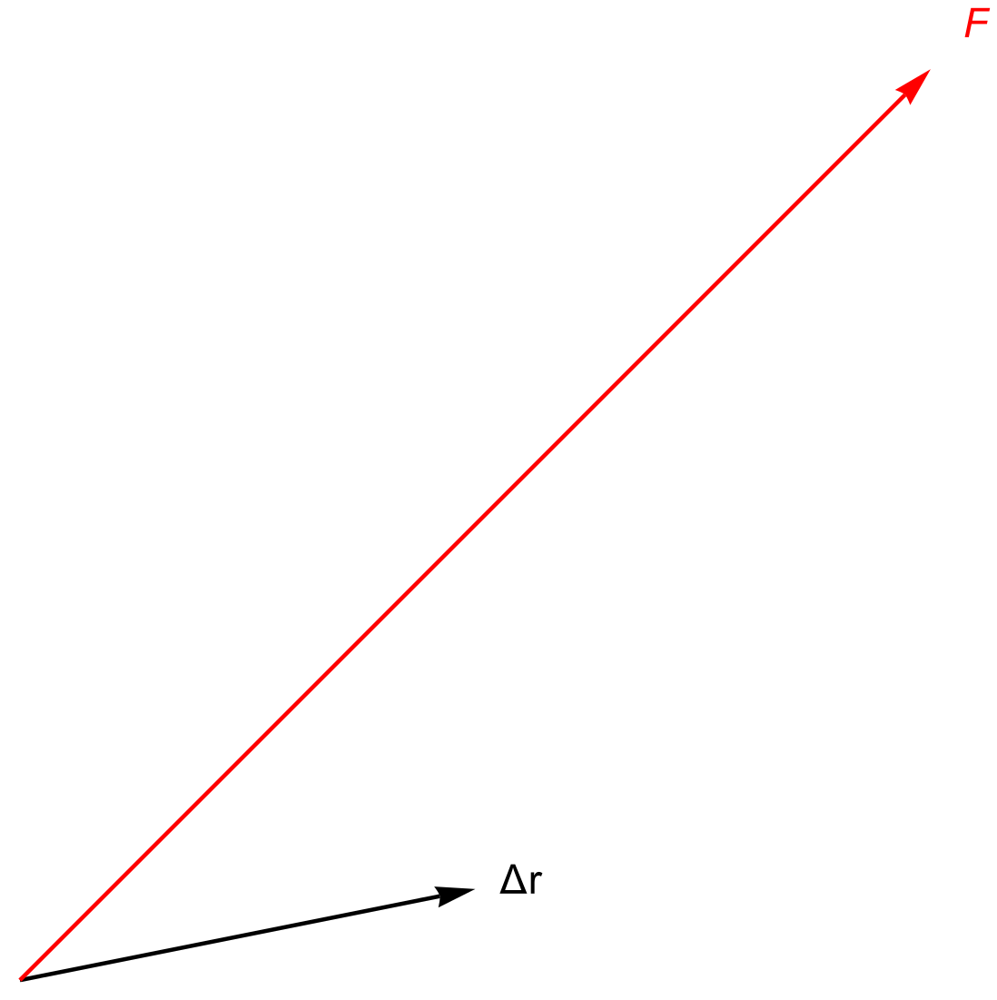

If the external force is not constant force, the total work done by the external force has to be divided the motion trajectory into infinitesimal segments, and then add the work done by the external force to each segment (that is, the dot product of the force vector and the distance vector). In essence, it is the integral.

$$
W=\lim _{\Delta r_{i} \rightarrow 0} \sum_{i} \vec{F} \cdot \vec{\Delta r_{i}}=\int_{C} \vec{F} \cdot d \vec{r}
$$
However, this method is not conducive to calculation because the vector cannot be integrated. Now turn the displacement into the product of the instantaneous velocity and the tiny time:
$$
W=\int_{C} \vec{F} \cdot d \vec{r}=\int_{t_{1}}^{t_{2}} \vec{F} \cdot\left(\frac{d \vec{r}}{d t} d t\right)=\lim _{\Delta t_{i} \rightarrow 0} \sum_{i} \vec{F} \cdot\left(\frac{\vec{\Delta r}}{\Delta t_{i}} \vec{\Delta t_{i}}\right)
$$
The method described above is a straightforward solution, and we have another way to solve it. Since $\vec{F}=\langle P, Q, R,\rangle, d \vec{r}=\langle d x, d y, d z\rangle$:
$$
\int_{C} \vec{F} \cdot d \vec{r}=\int_{C} P d x+Q d y+R d z
$$
From this result, it also is a **line integrals with respect to x, y, and z**, therefore, the opposite direction of the integration will result in the opposite result of the integration.

### Path Independence and Conservative Vector Fields

#### Fundamental Theorem for Line Integrals

In Calculus I we had the **Fundamental Theorem of Calculus** that told us how to evaluate definite integrals:
$$
\int_{a}^{b} F^{\prime}(x) d x=F(b)-F(a)
$$
For line integral, there is a similar theorem:

> If $\vec{F}=\nabla f$ is a gradient field and $C$ is any curve with endpoints $P_0=(x_0,y_0)$ and $P_1=(x_1,y_1)$ then: 
> $$
> \int_{C}\vec{F}\cdot d\vec{r}=f(x_1,y_1)-f(x_0,y_0)
> $$
> That is, for **gradient fields** the line integral is independent of the path taken, i.e., it **depends only on the endpoints** of C.

#### Proof of the theorem

Parameterize $x$ and $y$, $C$ is the trajectory that moves in $t$ time:
$$
x=x(t), \quad y=y(t), \quad t_{0} \leq t \leq t_{1}
$$
The differential of $x$ and $y$ are:
$$
d x=x^{\prime}(t) d t=\frac{d x}{d t} d t, \quad d y=y^{\prime}(t) d t=\frac{d y}{d t} d t
$$
According to the definition of gradient:
$$
\int_{C} \nabla f \cdot d \vec{r}=\int_{C}\left(f_{x} d x+f_{y} d y\right)=\int_{C}\left(f_{x} \frac{d x}{d t}+f_{y} \frac{d y}{d t}\right) d t
$$
On the basis of the chain rule:
$$
\frac{d f}{d t}=f_{x} \frac{d x}{d t}+f_{y} \frac{d y}{d t}
$$
Hence:
$$
\int_{C}\left(f_{x} \frac{d x}{d t}+f_{y} \frac{d y}{d t}\right) d t=\int_{t_{0}}^{t_{1}} \frac{d f}{d t} d t=f\left.(x(t), y(t))\right|_{t_{0}} ^{t_{1}}=f\left(P_{1}\right)-f\left(P_{0}\right)
$$

#### The relationship between path independence and conservative

Since the integral depends only on 2 endpoints in the gradient domain, if the path is closed, then the integral is equal to 0 and is written as follows:
$$
\oint_{C} \vec{F} \cdot d \vec{r}=0
$$
On the other hand, if for any closed curve, the formula above is established, that indicate this vector field is a conservative vector field. Which is:

> path independence is equivalent to conservative.

### Gradient Field and Potential Function

#### Discriminant of Gradient Field

If a vector field $\mathbf{F}=\mathrm{Mi}+\mathrm{Nj}​$ is a gradient field, its potential function $f(x,y)​$, thus:
$$
\begin{array}{c}{\vec{F}=M \hat{\imath}+N \hat{\jmath}=\nabla f=\left\langle f_{x}, f_{y}\right\rangle} \\ 
{\quad \Rightarrow M=f_{x}, \quad N=f_{y}} \\ {f_{x y}=f_{y x}\Rightarrow M_{y}=N_{x}}\end{array}
$$
So, for a vector field $\mathbf{F}=\mathrm{Mi}+\mathrm{Nj}​$ that is **defined everywhere in the plane and can be guided everywhere**, if there is $My = Nx​$, then this vector field is the gradient field.

#### Find Potential function

Take gradient field $\mathbf{F}=\left(4 x^{2}+8 x y\right) \mathbf{i}+\left(3 y^{2}+4 x^{2}\right) \mathbf{j}$ as an example.

##### Line integral

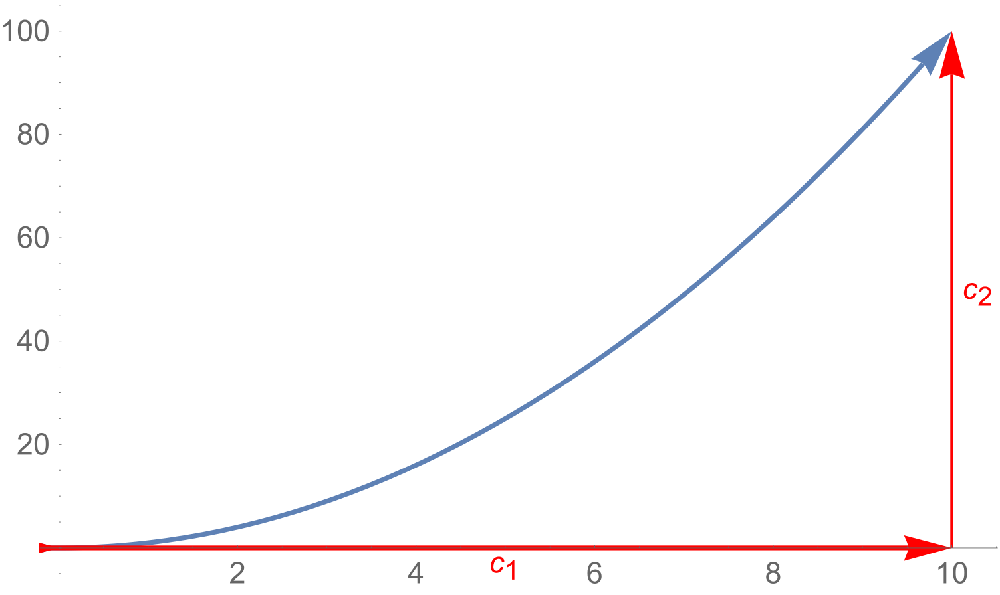

On $C_1$, $y=0, d y=0,0 \leq x \leq x_{1}$
$$
\int_{C_{1}} \vec{F} \cdot d \vec{r}=\int_{C_{1}}\left\langle 4 x^{2}+8 x y, 3 y^{2}+4 x^{2}\right\rangle \cdot\langle d x, d y\rangle=\int_{0}^{x_{1}} 4 x^{2} d x=\frac{4}{3} x_{1}^{3}
$$
On $C_2$, $x=x_{1}, d x=0,0 \leq y \leq y_{1}$
$$
\begin{aligned} \int_{C_{2}} \vec{F} \cdot d \vec{r} &=\int_{C_{2}}\left\langle 4 x^{2}+8 x y, 3 y^{2}+4 x^{2}\right\rangle \cdot\langle d x, d y\rangle \\ &=\int_{0}^{y_{1}}\left(3 y^{2}+4 x_{1}^{2}\right) d x=y_{1}^{3} \\ &=y_{1}^{3}+4 x_{1}^{2} y_{1} \end{aligned}
$$
Hence:
$$
\int_{C} \vec{F} \cdot d \vec{r}=\frac{4}{3} x_{1}^{3}+y_{1}^{3}+4 x_{1}^{2} y_{1}
$$
According to the Fundamental Theorem for Line Integrals:
$$
\int_{C} \vec{F} \cdot d \vec{r}=f(e n d)-f(s t a r t)=f\left(x_{1}, y_{1}\right)-f(0,0)
$$
Since $f(0,0)$ is a constant,remove the subscripts of $x$ and $y$ and get the potential function:
$$
f(x, y)=\frac{4}{3} x^{3}+y^{3}+4 x^{2} y+C
$$
##### Indefinite integral

The potential function $f$ satisfy:
$$
\left\{\begin{array}{l}{f_{x}=4 x^{2}+8 x y} \\ {f_{y}=3 y^{2}+4 x^{2}}\end{array}\right.
$$
Firstly, think $y$ as a constant , find the integral of $x$:
$$
f=\int\left(4 x^{2}+8 x y\right) d x=\frac{4}{3} x^{3}+4 x^{2} y+g(y)
$$
Since $f_x$ is partial derivative, so the final is not a constant $C$, but a function $g(y)$ instead.
$$
\begin {equation} 
\begin{array}{l}{f_{y}=\frac{\partial f}{\partial y}=\frac{\partial}{\partial y}\left(\frac{4}{3} x^{3}+4 x^{2} y+g(y)\right)=4 x^{2}+g^{\prime}(y)=3 y^{2}+4 x^{2}} \\ {\Rightarrow g^{\prime}(y)=3 y^{2}} \\ {\quad\Rightarrow g(y)=\int 3 y^{2} d y=y^{3}+C} \\ {\Rightarrow f(x, y)=\frac{4}{3} x^{3}+4 x^{2} y+g(y)=\frac{4}{3} x^{3}+4 x^{2} y++y^{3}+C}\end{array}
 \end {equation}
$$
Note: $g(y)$ can’t contain $x$, otherwise $g(y)$ isn’t equal to 0 when calculate $f_x$.

### Green's theorem

#### Curl

The curl of the vector field measures the rotating part of the motion, which expresses the degree of torsion at a given point, expressed as a mathematical symbol:
$$
curl(\vec{F})=N_x-M_y
$$
The magnitude of the curl indicates the degree of twist, and positive or negative indicates whether the rotation is clockwise or counterclockwise. As can be seen from the previous chapter, the convolution is 0 in the conservative.

For example, if the swirl of the airflow or water flow is 0, it means there is no eddy current. Such that，$\mathbf{F}=x\mathrm{i}+y\mathrm{j}$:

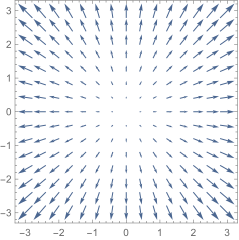
$$
\operatorname{curl}(x \hat{\imath}+y \hat{\jmath})=N_{x}-M_{y}=0
$$
In complex motion, some points may rotate more than others, and the curl is not constant at this time, it depends on the position of the point, that is, the values of $x$ and $y$. In the weather map, the high rotation may be a typhoon or a tornado:

**In the force field, the curl measures the torque at any point, or the torque is the corresponding amount of force rotation.**

#### Green's theorem

As shown in the figure below, there is a closed curve $C$, and the area enclosed by it is $R$. Then we want to calculate the line integral of  $C$，there are two choices, one is direct calculation and the other is using Green's theorem.

Green's theorem:
$$
\oint \vec{F}\ d \vec{r}=\iint_R curl(\vec{F})dA\\
\oint(Mdx+Ndy)=\iint_R (N_x-M_y)dA
$$
Note,  in  the above formula, the curve is defined as counterclockwise, otherwise, the right hand of above formula is $\iint_{R}-\left(N_{x}-M_{y}\right) d A$

#### Proof of Green's theorem

This theorem looks pretty strange, how it comes from?

Assume the field is defined as $\mathbf{F}=\mathrm{Mi}$, that is $\mathbf{N}=0$, now we try to prove:
$$
\oint_{C} M d x=\iint_{R}-M_{y} d A
$$
If we succeed, for the same reason:
$$
\oint_{C} N d y=\iint_{R} N_{x} d A
$$
Add together, we prove Green's theorem.

Firstly, consider the following picture:

The closed area enclosed by C is divided into two parts, C1 and C2, which are all counterclockwise. 

The line integrals of C1 and C2 are added together, and the dividing line is calculated twice more. 

However, pay attention to the direction of C1 and C2 on the boundary line, the two are opposite, so they are offset on the boundary line, so:
$$
\oint_{C} M d x=\oint_{C_{1}} M d x+\oint_{C_{2}} M d x
$$
If the Green's theorem is established:
$$
\begin{aligned} \oint_{C} M d x &=\oint_{C_{1}} M d x+\oint_{C_{2}} M d x \\ &=-\iint_{R_{1}} M_{y} d A-\iint_{R_{2}} M_{y} d A \\ &=-\iint_{R} M_{y} d A \end{aligned}
$$
By extension, for more complex curves, it can always be divided into a number of relatively simple small regions. If the Green's formula is true, the line integral of the curve is equal to the sum of the double integrals of all small regions. 

Hence, for simple small areas, you can divide into a myriad of vertical rectangles:

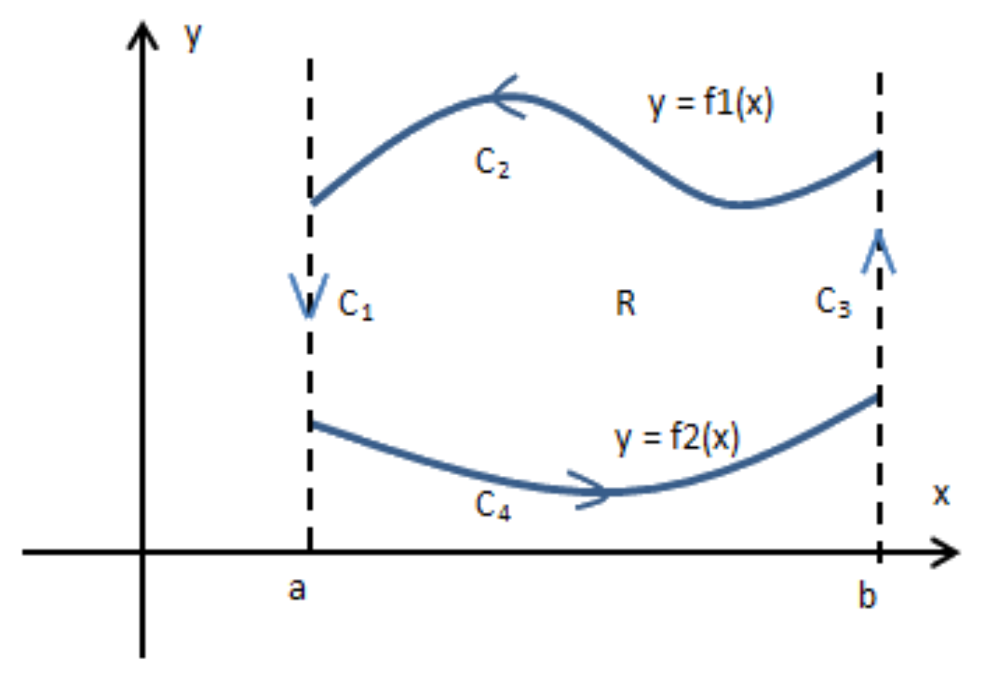

On $C_1$ and $C_3$, $dx=0$
$$
\begin{aligned} \oint_{c} M d x &=\int_{C_{1}} M d x+\int_{c_{2}} M d x+\int_{c_{3}} M d x+\int_{c_{4}} M d x \\ &=\int_{c_{2}} M d x+\int_{c_{4}} M d x \\ &=\int_{b}^{a} M(x, f 1(x)) d x+\int_{a}^{b} M(x, f 2(x)) d x \\ &=-\int_{a}^{b} M(x, f 1(x)) d x+\int_{a}^{b} M(x, f 2(x)) d x \end{aligned}
$$
On the other hand:
$$
\begin{aligned} \iint_{R}-M_{y} d A &=-\int_{a}^{b} \int_{f 2(x)}^{f 1(x)} \frac{\partial M}{\partial y} d y d x \\ &=-\int_{a}^{b}(M(x, f 1(x))-M(x, f 2(x))) d x \\ &=-\int_{a}^{b} M(x, f 1(x)) d x+\int_{a}^{b} M(x, f 2(x)) d x \\ &=\oint_{C} M d x \end{aligned}
$$
QED.

#### Example

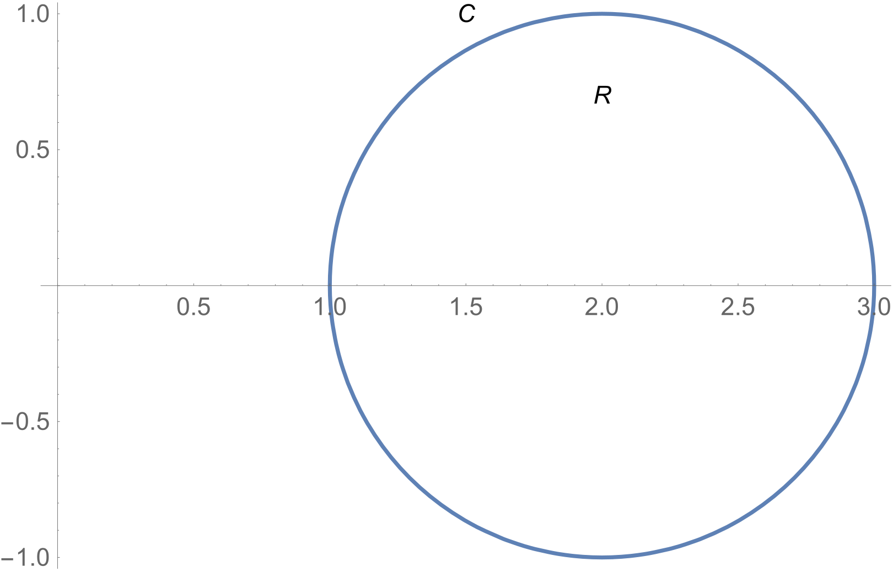

As shown in the figure above, $C​$ is a circle with a radius of 1 that rotates counterclockwise.

Calculates the line integral of $C$ in the field $F=\langle y e^{-x},\frac{x^2}{2}-e^{-x}\rangle$:
$$
\oint_{c} \vec{F} d \vec{r}=\oint_{c}\left(y e^{-x} d x+\left(\frac{1}{2} x^{2}-e^{-x}\right) d y\right)=?
$$
Firstly, determine if the field is a conservative field:
$$
\begin{array}{c}{M_{y}=\frac{\partial}{\partial y} y e^{-x}=e^{-x}, \quad N_{x}=\frac{\partial}{\partial x}\left(\frac{1}{2} x^{2}-e^{-x}\right)=x+e^{-x}} \\ {M_{y} \neq N_{x}}\end{array}
$$
Apply Green’s theorem:
$$
\oint_{C} \vec{F} d \vec{r}=\iint_{R}\left(N_{x}-M_{y}\right) d A=\iint_{R}\left(x+e^{-x}-e^{-x}\right) d A=\iint_{R} x d A
$$
For the sake of simplicity, integral the $\frac{1}{4}$ circle:

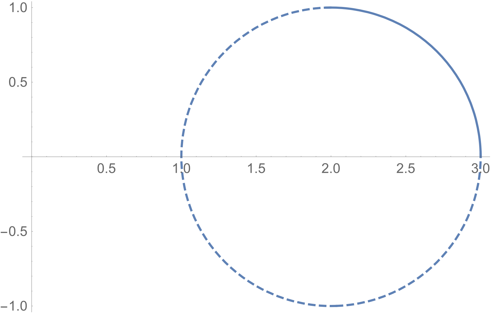
$$
\iint_{\frac{R}{4}} x d A=\int_{2}^{3} \int_{\sqrt{1-(x-2)^{2}}}^{0} x d y d x=\int_{2}^{3}-x \sqrt{1-(x-2)^{2}} d x=\frac{\pi}{2}
$$
In summary:
$$
\iint_{R} x d A=4 \iint_{\frac{R}{4}} x d A=2 \pi
$$

### Flux

Flux is actually a kind of line integral. If there is a plane curve $C$ and a vector field $F​$ on a plane, the flux is represented by a symbol:
$$
\int_{C} \vec{F} \cdot \hat{n} d s
$$
Where $ds$ is the micro-element of curve $C$, and $\hat{n}$ is the unit normal vector perpendicular to $ds$:

If $F$ is seen as a velocity field, such as, the water is flowing at a certain speed, then $F$ is explained as the flow of water at every point on the plane. The flux of curve $C$ in $F$ measures how much fluid flows through curve $C$ per unit time. $F$ can be regarded as a river, $C​$ is a fishing net located in the river, the flux measures how much river water flows through the fishing net per unit time.

As the following figure:

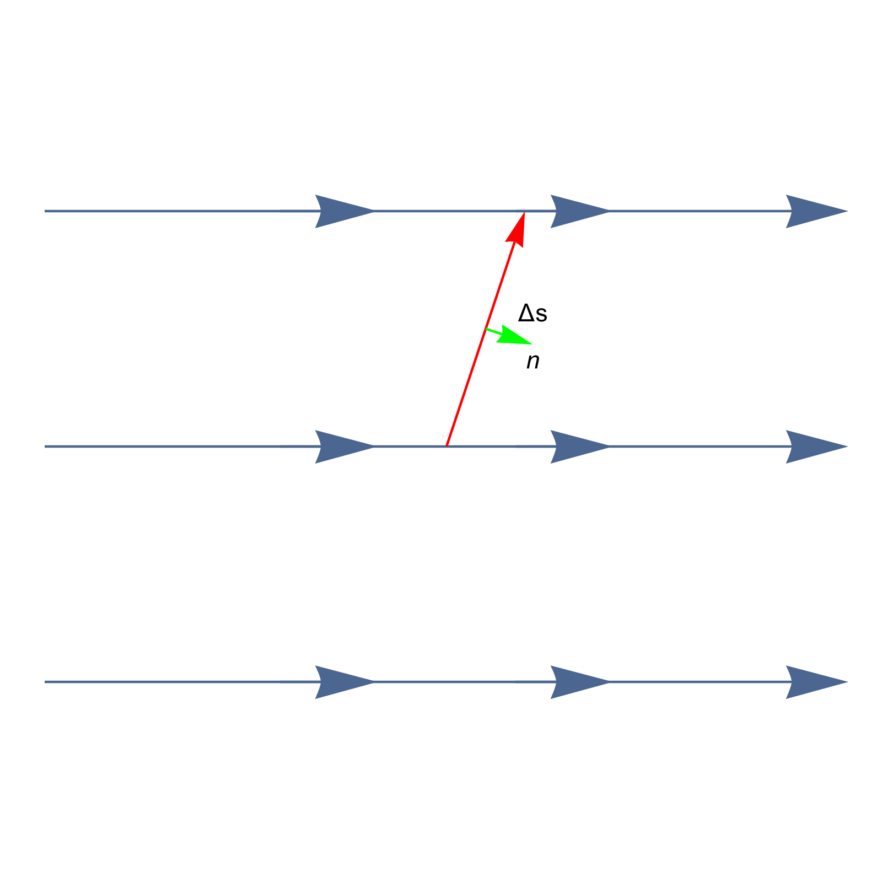

After unit time, water flows through $\Delta s$ is a parallelogram:

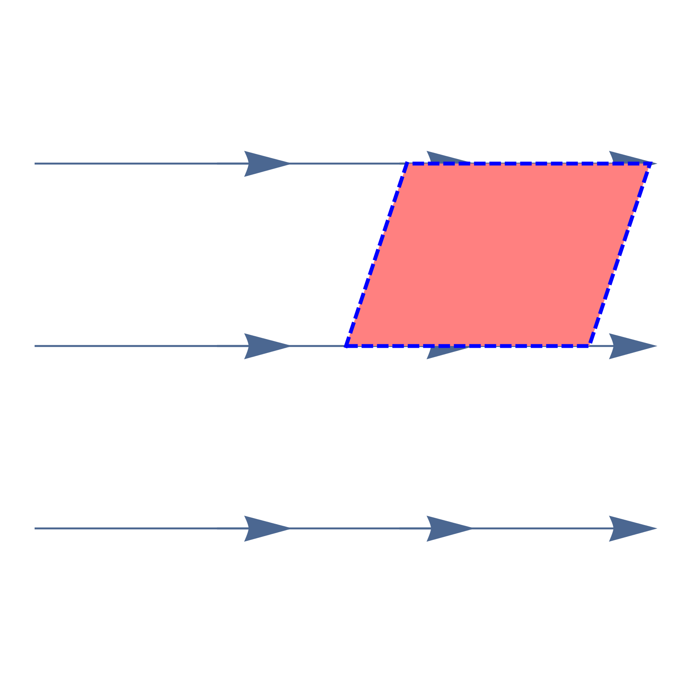

Its area can be calculated as:
$$
Area =\Delta S\cdot \text {Height}=\Delta S(\vec{F} \cdot \hat{n})
$$
Assume vector field $F=\langle M,N \rangle$:
$$
\int_{C} \vec{F} \cdot \hat{n} d s=\int_{C}\langle M, N\rangle \cdot\langle d y,-d x\rangle=\int_{C} M d y-N d x
$$
According to Green’s theorem:
$$
\oint_{C} M d y-N d x=\iint_{R}\left(M_{x}+N_{y}\right) d A
$$
The above formula is also known as the orthogonal form of the Green's theorem, which is another expression of the Green's theorem. 

#### Comparison between work and flux

- Work:
  $$
  \int_{C} \vec{\mathbf{F}} \cdot d \vec{\mathbf{r}}=\int_{C} \vec{\mathbf{F}} \cdot \hat{\mathbf{T}} d s
  $$
  summing **tangential** component of $\vec{F}$.

- Flux:
  $$
  \int_{C} \vec{\mathbf{F}} \cdot \hat{\mathbf{n}} d s
  $$
  summing **normal** component of $\vec{F}$.

### Divergence

For a vector field $\vec{F}=\langle M, N\rangle$, we have:
$$
\operatorname{div}(\vec{F})=M_{x}+N_{y}
$$
Where $div(\vec{F})​$ is divergence, it measures the degree of fluid divergence. 

#### Physical interpretation  of divergence

If we think of $\vec{v}$ as the **velocity field** of a flowing fluid, then $div\ \vec{v}$ represents the net rate of change of the mass of the fluid flowing from the point $(x,y,z)$ per unit volume. This can also be thought of as the **tendency of a fluid to diverge​** from a point, which can become less dense, more dense or just unchanged:

### Curl and Divergence

#### Delta

$\Delta$ is used as a shorthand form to simplify many long mathematical expressions. It is most commonly used to simplify expressions for the gradient, divergence, curl, directional derivative, and Laplacian.

1. The vector derivative of a scalar field $f$ is called the **gradient**, and it can be represented as: 
   $$
   \operatorname{grad} f=\left\langle\frac{\partial f}{\partial x}, \frac{\partial f}{\partial y}, \frac{\partial f}{\partial z}\right\rangle=\nabla f
   $$

2. The **divergence** of a vector field $\vec{v}=\langle P, Q, R\rangle$ is a scalar function that can be represented as: 
   $$
   \operatorname{div}\ \vec{v}=\frac{\partial P}{\partial x}+\frac{\partial Q}{\partial y}+\frac{\partial R}{\partial z}=\nabla \cdot \vec{v}
   $$

3. The **curl** of a vector field $\vec{v}=\langle P, Q, R\rangle$ is a vector function that can be represented as: 
   $$
   \operatorname{curl} \vec{v}=\left[ \begin{array}{ccc}{\vec{i}} & {\vec{j}} & {\vec{k}} \\ {\frac{\partial}{\partial x}} & {\frac{\partial}{\partial y}} & {\frac{\partial}{\partial z}} \\ {P} & {Q} & {R}\end{array}\right]=\nabla \times \vec{v}
   $$

#### Review of Green’s Theorem

The Green's theorem is actually about the relationship between a particular type of double integrals(on closed paths). The Green's theorem must satisfy the following elements:

- $C$ a **simple closed** curve (simple means it never intersects itself)
- $R$ is the **interior** of $C$
- C must be **positively oriented**
- C must be **piecewise smooth**

Like the following figure:

Now, the Green’s theorem can be written as:
$$
\oint_{C}(M d y-N d x)=\iint_{R} \operatorname{div}(\vec{F}) d A=\iint_{R}\left(M_{x}+N_{y}\right) d A\\
\oint_{C}(M d x+N d y)=\iint_{R} \operatorname{curl}(\vec{F}) d A=\iint_{R}\left(N_{x}-M_{y}\right) d A
$$

### Connected Area

There is a precondition for the Green’s theorem: the vector field needs to be defined at everywhere in the $R$ region, and more strictly $F$ is defined at the R region. If there is a point that is not defined in the vector field, you cannot simply use the Green’s theorem, for example:
$$
\vec{F}=\frac{-y \hat{\imath}+x \hat{\jmath}}{x^{2}+y^{2}}
$$
Let $x=\cos \theta$, $y=\sin \theta$:                     
$$
\begin{aligned} N_{x} &=\frac{\partial}{\partial x}\left(\frac{x}{x^{2}+y^{2}}\right)=\frac{d x}{d \theta} \frac{d}{d x}\left(\frac{\cos \theta}{\cos ^{2} \theta+\sin ^{2} \theta}\right)=-\sin \theta \cos \theta \\ M_{y} &=\frac{\partial}{\partial y}\left(\frac{-y}{x^{2}+y^{2}}\right)=\frac{d y}{d \theta} \frac{d}{d x}\left(\frac{-\sin \theta}{\cos ^{2} \theta+\sin ^{2} \theta}\right)=-\sin \theta \cos \theta \end{aligned}
$$
$F$ is meaningful except for the origin, and the curl is 0 at any position. If there is also a definition at the origin, this will be a conservative field. 

There are two cases at this point, the curve encloses the origin and the curve outside the origin:

If you dig the origin on $C_2$, the new $R$ area satisfy the Green’s theorem:

If you link a continuous curve with two opposite vectors, $C$ and $C'$ become a curve that communicates with each other, as shown in the following figure:

$$
\oint_{C} \hat{F} \cdot d \hat{r}+\oint_{c^{\prime}} \hat{F} \cdot d \hat{r}=\iint_{R} \operatorname{curl}(\vec{F}) d A=0
$$
The $R$ region is called a multi-connected zone, as opposed to a single connected zone. In other words, a single connected area is an area without "holes", and a multi-connected area is an area with "holes" that must be on $R$.

