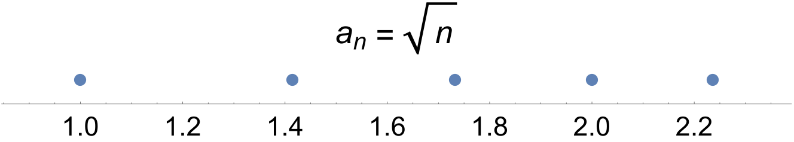
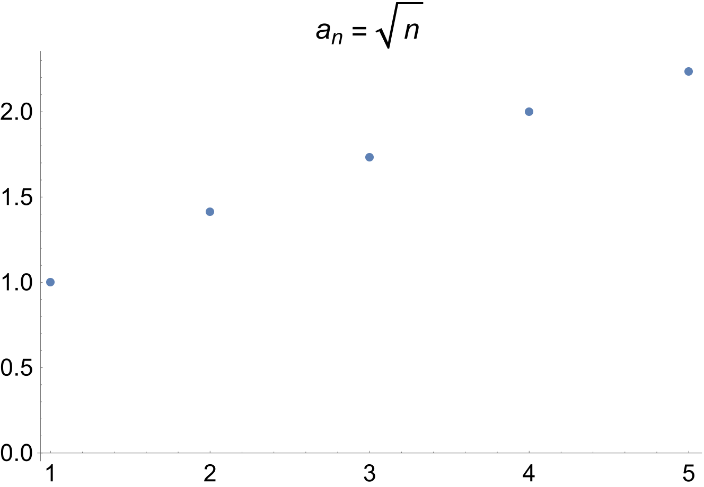
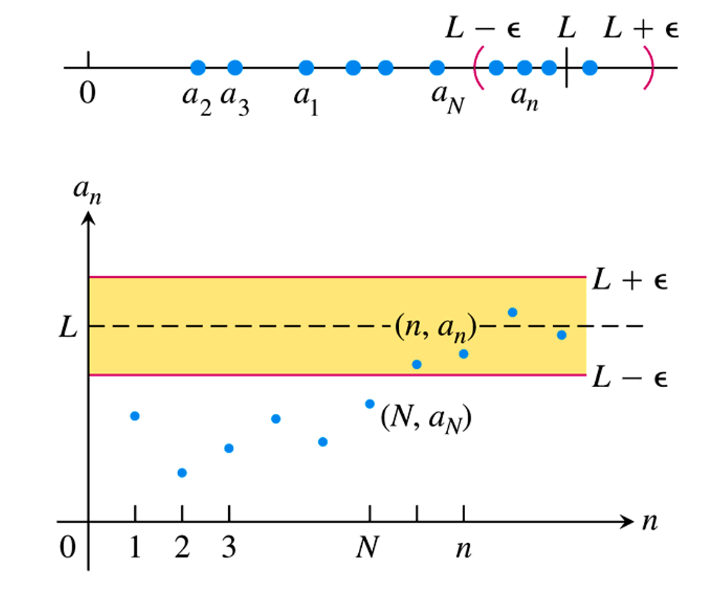
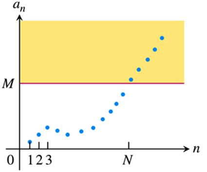

---

typora-copy-images-to: ./
typora-root-url: ./
---

# Infinite Sequences and Series

## Sequences

Sequences can be represented as points on the real line or as points in the plane where the horizontal axis $n$ is the index number of the term and the vertical axis $a_n$ is its value

> The sequence $\{a_n\}​$ **converges** to the number $L​$ if for every positive number $\epsilon​$ there corresponds an integer $N​$ such that for all $n​$,
> $$
> n>N \quad \Rightarrow \quad\left|a_{n}-L\right|<\epsilon
> $$
> If no such number $L$ exists, we say that $\{a_n\}$ diverges.
>
> If $\{a_n\}$ converges to $L$, we call $L$ the **limit** of the sequence.

> The sequence $\{a_n\}$ **diverges to infinity** if for every number $M$ there is an integer $N$ such that for all $n$ larger than $N$, $a_{n}>M$. 
> $$
> \lim _{n \rightarrow \infty} a_{n}=\infty \quad \text { or } \quad a_{n} \rightarrow \infty
> $$

Let $\{a_n\}$ and $\{b_n\}$ be sequences  of real numbers, and let $A$ and $B$ be real numbers. Assume $\lim _{n \rightarrow \infty} a_{n}=A$ and $\lim _{n \rightarrow \infty} b_{n}=B$, the following rules hold

1. *Sum Rule*:
   $$
   \lim _{n \rightarrow \infty}\left(a_{n}+b_{n}\right)=A+B
   $$

2. *Difference Rule*:
   $$
   \lim _{n \rightarrow \infty}\left(a_{n}-b_{n}\right)=A-B
   $$

3. *Constant Multiple Rule*:
   $$
   \lim _{n \rightarrow \infty}\left(k \cdot b_{n}\right)=k \cdot B
   $$

4. *Product Rule*:
   $$
   \lim _{n \rightarrow \infty}\left(a_{n} \cdot b_{n}\right)=A \cdot B
   $$

5. *Quotient Rule*:
   $$
   \lim _{n \rightarrow \infty} \frac{a_{n}}{b_{n}}=\frac{A}{B} \quad \text { if } B \neq 0
   $$

In sequence, we also have **The sandwich theorem**

> Let $\{a_n\}$, $\{b_n\}$, and $\{c_n\}$ be sequences of real numbers. If $a_{n} \leq b_{n} \leq c_{n}$ holds for all $n$ beyond some index $N$, and if $\lim _{n \rightarrow \infty} a_{n}=\lim _{n \rightarrow \infty} c_{n}=L$, then $\lim _{n \rightarrow \infty} c_{n}=L$ also.

We can take a sequence to approach a function because of **The continuous function theorem for sequences**

> Let $\{a_n\}$ be a sequence or real numbers. If $a_{n} \rightarrow L$ and if $f$ is a function that is continuous at $L$ and defined at all $a_n$, then $f\left(a_{n}\right) \rightarrow f(L)$.

Therefore

> Suppose that $f(x)$ is a function defined for all $x \geq n_{0}$ and that $\{a_n\}$ is a sequence of real numbers such that $a_n=f(n)$ for $n \geq n_{0}$. Then
> $$
> \lim _{x \rightarrow \infty} f(x)=L \quad \Rightarrow \quad \lim _{n \rightarrow \infty} a_{n}=L
> $$

We can give the definitions of **bounded** as follows:

A sequence $\{a_n\}$ is **bounded from above** if there exists a number $M$ such that $a_n \leq M$ for all $n$. The number $M$ is an **upper bound** for $\{a_n\}$. If $M$ is an upper bound for $\{a_n\}$ but no number less than $M$ is an upper bound for $\{a_n\}$, then $M$ is the **least upper bound** for  $\{a_n\}$.

Similarly, A sequence $\{a_n\}​$ is **bounded from below** if there exists a number $m​$ such that $a_n \geq m​$ for all $n​$. The number $n​$ is an **lower bound** for $\{a_n\}​$. If $m​$ is an upper bound for $\{a_n\}​$ but no number less than $M​$ is an upper bound for $\{a_n\}​$, then $m​$ is the **least lower bound** for  $\{a_n\}​$.

If $\{a_n\}​$ is bounded from above and below, the $\{a_n\}​$ is **bounded**. If $\{a_n\}​$ is not bounded, $\{a_n\}​$ is an **unbounded** sequence. The following figure us a bounded sequence.

 A sequence $\{a_n\}$ is **nondecreasing** if $a_{n} \leq a_{n+1}$ for all $n$, and is **nonincreasing** if $a_{n} \geq a_{n+1}$ for all $n$. The sequence is **monotonic** if it is nondecreasing or nonincreasing. 

Then we obtain the monotonic sequence theorem as follows:

> If a sequence $\{a_n\}​$ is both bounded and monotonic, then the sequence converges.

## Infinite Series

Given a sequence of numbers $\{a_n\}​$, an expression of the form
$$
a_{1}+a_{2}+a_{3}+\cdots+a_{n}+\cdots
$$
is an **infinite series**. The number $a_n$ is the **nth term** of the series. The sequence ${s_n}$ defined by
$$
\begin{aligned} s_{1} &=a_{1} \\ s_{2} &=a_{1}+a_{2} \\ & \vdots \\ s_{n} &=a_{1}+a_{2}+\cdots+a_{n}=\sum_{k=1}^{n} a_{k} \\ & \vdots \end{aligned}
$$
is the **sequence of partial sums** of the series. If the sequence converges to a limit $L​$, we say that the series **converges** and that its **sun** is $L​$. That is 
$$
a_{1}+a_{2}+\cdots+a_{n}+\cdots=\sum_{n=1}^{\infty} a_{n}=L
$$
If the sequence of partial sums of the series does not converge, we say that the series **diverges**.

## The Integral Test

A series $\sum_{n=1}^{\infty} a_{n}​$ of nonnegative terms converges if and only if its partial sums are bounded from above.

Let $\{a_n\}​$ be a sequence of positive terms. Suppose that $a_n=f(n)​$, where $f​$ is a continuous, positive, decreasing function. Then the series $\sum_{n=1}^{\infty} a_{n}​$ and the integral $\int_{N}^{\infty} f(x) d x​$ both converge or diverge. This property is called **the integral test**. In this case, suppose $\sum{a_n}​$ converges to $S​$, the remainder $R_n=S-S_n​$ satisfies the inequalities
$$
\int_{n+1}^{\infty} f(x) d x \leq R_{n} \leq \int_{n}^{\infty} f(x) d x
$$

## Comparison Tests

Let $\sum{a_n}​$, $\sum{c_n}​$, and $\sum{d_n}​$ be series with nonnegative terms. Suppose that for some integer $N​$
$$
d_{n} \leq a_{n} \leq c_{n} \quad \text { for all } \quad n>N
$$
We know that

1. If $\sum{c_n}$ converges, then $\sum{a_n}$ also converges.
2. If $\sum{d_n}$ diverges, then $\sum{a_n}$ also diverges.

for more general cases, suppose that $a_n>0$ and $b_n>0$ for all $n\geq N$

1. $\lim _{n \rightarrow \infty} \frac{a_{n}}{b_{n}}=c>0​$,then $\sum{a_n}​$ and $\sum{b_n}​$ both converge or both diverge.
2. $\lim _{n \rightarrow \infty} \frac{a_{n}}{b_{n}}=0$, then if $\sum b_n$ converges, $\sum a_n$ converges.
3. $\lim _{n \rightarrow \infty} \frac{a_{n}}{b_{n}}=\infin$, then if $\sum b_n$ diverges, $\sum a_n$ diverges.

## Absolute Convergence and The Ratio and Root Tests

> A series $\sum {a_n}​$ **converges absolutely** if $\sum\left|a_{n}\right|​$ converges.

following is an important theorem **the absolute convergence test**.

> If $\sum\left|a_{n}\right|​$ converges, then $\sum {a_n}​$ converges.

Let $\sum {a_n}​$ be any series and suppose that 
$$
\lim _{n \rightarrow \infty}\left|\frac{a_{n+1}}{a_{n}}\right|=\rho
$$
Then we assert

1. the *series converges absolutely* if $\rho <1$
2. the series *diverges* if $\rho>1​$ or $\rho​$ is infinite.

which is **the ratio test**.

And we have **the root test**:

Let $\sum {a_n}$ be any series and suppose that 
$$
\lim _{n \rightarrow \infty} \sqrt[n]{\left|a_{n}\right|}=\rho
$$
then

1. the *series converges absolutely* if $\rho =1​$
2. the series *diverges* if $\rho>1​$ or $\rho​$ is infinite.

## Alternating Series and Conditional Convergence

The series
$$
\sum_{n=1}^{\infty}(-1)^{n+1} u_{n}=u_{1}-u_{2}+u_{3}-u_{4}+\cdots
$$
converges if all of the following are satisfied:

1. The $u_n$ are all positive
2. The positive $u_n$ are nonincreasing, that is $u_n \geq u_{n+1}$ for all $n \geq N$ for some $N$
3. $u_{n} \rightarrow 0$

For a series satisfies the above conditions, let $s_n = \sum_{n=1}^{\infty}(-1)^{n+1}​$, then for $n \geq N​$, $s_n​$ approximates the sum $L​$ of the series with an error whose absolute value is less than $|u_{n+1}|​$.

Furthermore, the sum $L​$ lies between any two successive partial sums $s_n​$ and $s_{n+1}​$.

> A convergent series that is not absolutely convergent is **conditionally convergent**

If $\sum {a_n}$ converges absolutely, and $b_1, b_2, \cdots, b_n, \cdots$ is any arrangement of the sequence $\{a_n\}$, then $\sum {b_n}$ converges absolutely and
$$
\sum_{n=1}^{\infty} b_{n}=\sum_{n=1}^{\infty} a_{n}
$$

## Power Series

A **power series about $x=a$** is a series of the form
$$
\sum_{n=0}^{\infty} c_{n}(x-a)^{n}=c_{0}+c_{1}(x-a)+c_{2}(x-a)^{2}+\cdots+c_{n}(x-a)^{n}+\cdots
$$
in which the **center** $a$ and the **coefficients** $c_n$ are constants.

For this kind of series, we have **the convergence theorem for power series**:

> If the power series $\sum_{n=0}^{\infty} a_{n} x^{n}=a_{0}+a_{1} x+a_{2} x^{2}+\cdots$ converges at $  x=c \neq 0  $, then it converges absolutely for all $x$ with $|x|<|c|$. If the series diverges at $  x=d $, then it converges absolutely for all $x$ with $|x|>|c|$. 

If $A(x)=\sum_{n=0}^{\infty} a_{n} x^{n}$ and $B(x)=\sum_{n=0}^{\infty} b_{n} x^{n}$ converge absolutely for $|x|<R$, and $c_{n}=\sum_{k=0}^{n} a_{k} b_{n-k}$
the $\sum_{n=0}^{\infty} c_{n} x^{n}$ converges absolutely to $A(x)B(x)$, that is
$$
\left(\sum_{n=0}^{\infty} a_{n} x^{n}\right) \cdot\left(\sum_{n=0}^{\infty} b_{n} x^{n}\right)=\sum_{n=0}^{\infty} c_{n} x^{n}
$$

If power series $f(x)=\sum_{n=0}^{\infty} c_{n}(x-a)^{n}$ converges at $a-R<x<a+R$, the derivation of $f$ is still converges
$$
\begin{aligned} f^{\prime}(x) &=\sum_{n=1}^{\infty} n c_{n}(x-a)^{n-1} \\ f^{\prime \prime}(x) &=\sum_{n=2}^{\infty} n(n-1) c_{n}(x-a)^{n-2} \end{aligned}
$$
Similarly, the integration of $f​$ is also converges:
$$
\int f(x) d x=\sum_{n=0}^{\infty} c_{n} \frac{(x-a)^{n+1}}{n+1}+C
$$

## Taylor and Maclaurin Series

**Taylor series generated by $f$ at $x=a$ ** is 
$$
\begin{aligned} \sum_{k=0}^{\infty} \frac{f^{(k)}(a)}{k !}(x-a)^{k}=f(a)+f^{\prime}(a)(x-a)+\frac{f^{\prime \prime}(a)}{2 !}(x-a)^{2} \\+\cdots+\frac{f^{(n)}(a)}{n !}(x-a)^{n}+\cdots \end{aligned}
$$
The **Maclaurin series of $f$** is the Taylor series generated by $f$ at $x=0$
$$
\sum_{k=0}^{\infty} \frac{f^{(k)}(0)}{k !} x^{k}=f(0)+f^{\prime}(0) x+\frac{f^{\prime \prime}(0)}{2 !} x^{2}+\cdots+\frac{f^{(n)}(0)}{n !} x^{n}+\cdots
$$
Based on above formula, we can defined **Taylor polynomial of order n** as follows:
$$
\begin{aligned} P_{n}(x)=f(a)+f^{\prime}(a)(x-a) &+\frac{f^{\prime \prime}(a)}{2 !}(x-a)^{2}+\cdots \\ &+\frac{f^{(k)}(a)}{k !}(x-a)^{k}+\cdots+\frac{f^{(n)}(a)}{n !}(x-a)^{n} \end{aligned}
$$

## Convergence of Taylor Series

If $f$ and its first $n$ derivatives 