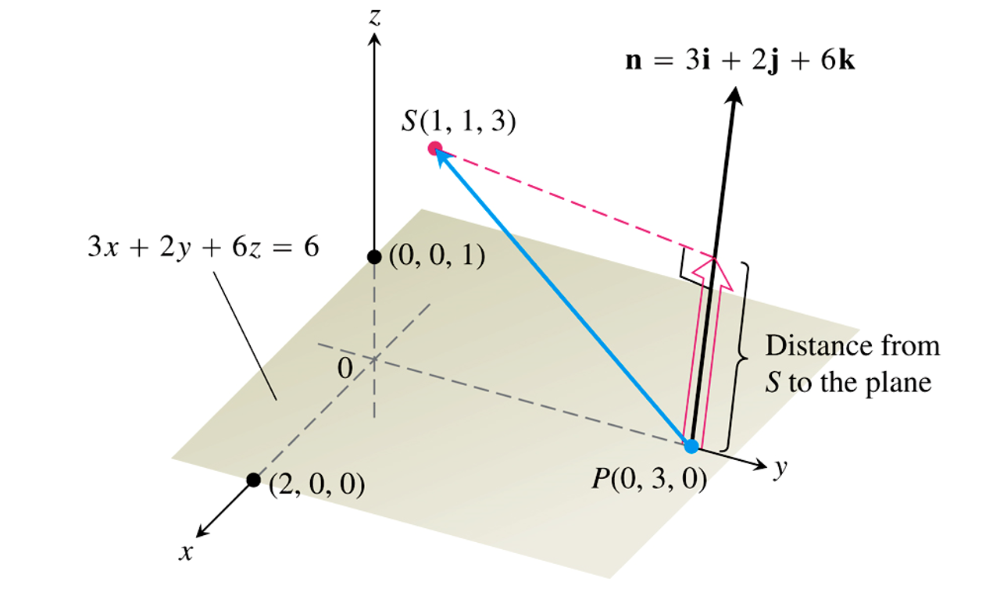
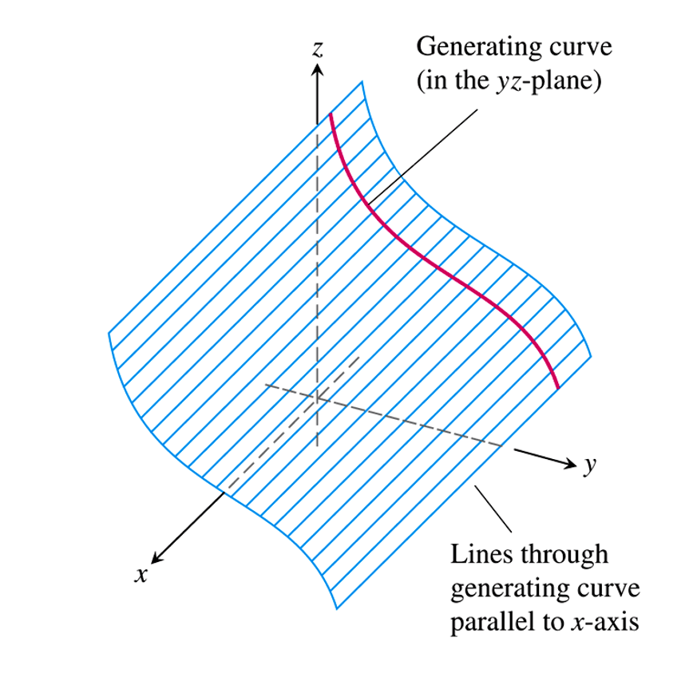
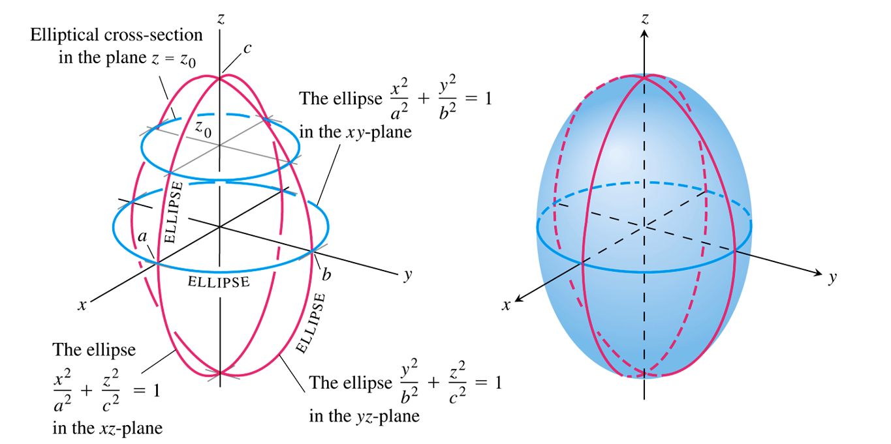
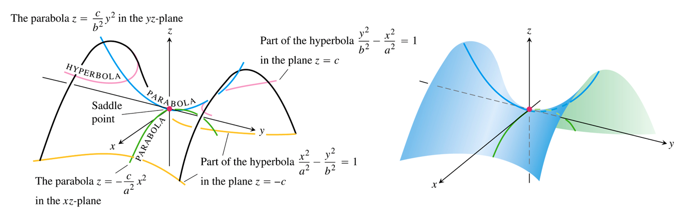
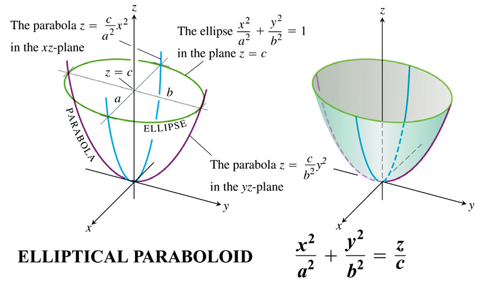
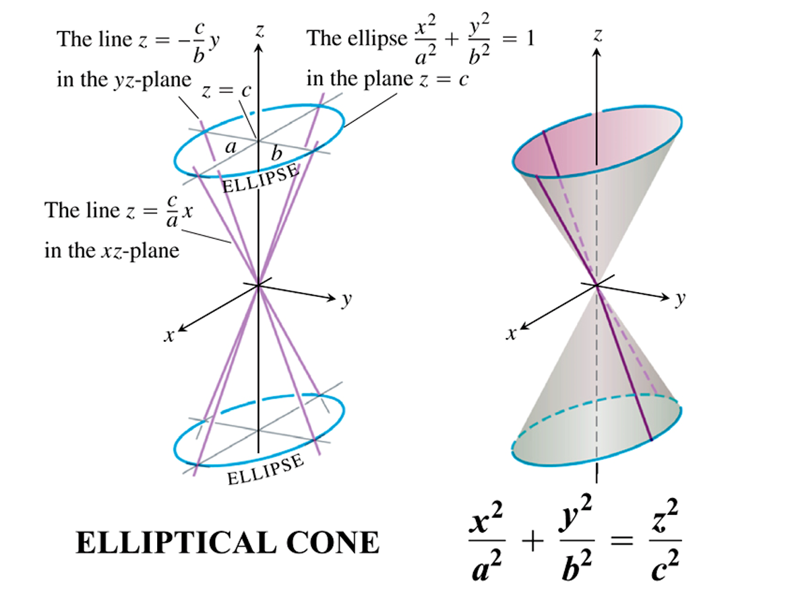
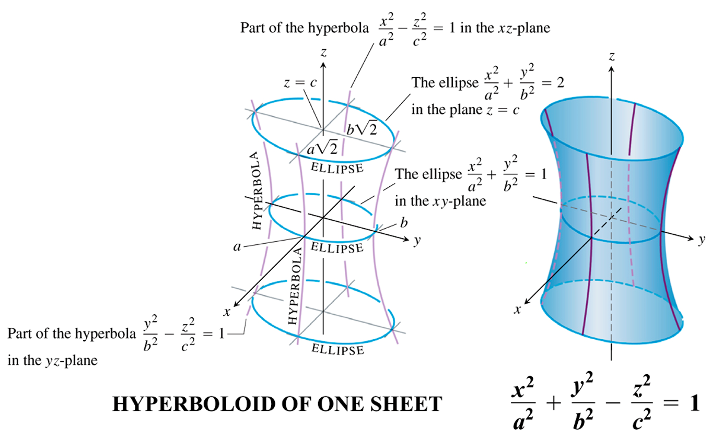
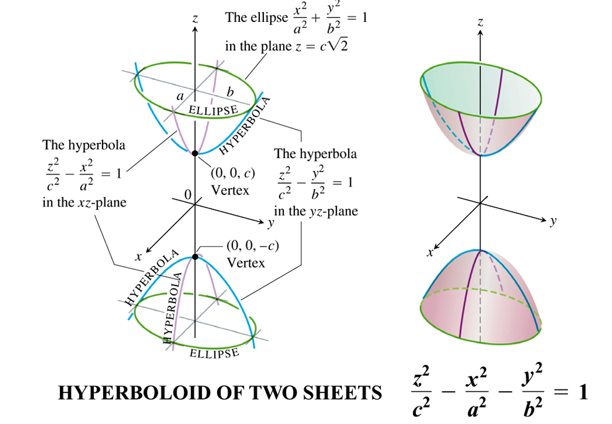

### Vectors and the Geometry of Space

The 3 **coordinate planes** divide space into 8 cells called **octant**, the $(+,+,+)$ octant is called the **first octant**.

The distance between two point is 
$$
\left|P_{1} P_{2}\right|=\sqrt{\left(x_{2}-x_{1}\right)^{2}+\left(y_{2}-y_{1}\right)^{2}+\left(z_{2}-z_{1}\right)^{2}}
$$
The cross product $u\times v$ is:
$$
\mathbf{u} \times \mathbf{v}=(|\mathbf{u}||\mathbf{v}| \sin \theta) \mathbf{n}
$$

Hence nonzero vectors $u$ and $v$ are parallel if and only if $u \times v=0$.

Cross product has some properties
$$
\begin{array}{ll}{\text { 1. }(r \mathbf{u}) \times(s \mathbf{v})=(r s)(\mathbf{u} \times \mathbf{v})} & {\text { 2. } \mathbf{u} \times(\mathbf{v}+\mathbf{w})=\mathbf{u} \times \mathbf{v}+\mathbf{u} \times \mathbf{w}} \\ {3 . \mathbf{v} \times \mathbf{u}=-(\mathbf{u} \times \mathbf{v})} & {\text { 4. }(\mathbf{v}+\mathbf{w}) \times \mathbf{u}=\mathbf{v} \times \mathbf{u}+\mathbf{w} \times \mathbf{u}} \\ {\text { 5. } \mathbf{0} \times \mathbf{u}=\mathbf{0}} & {\text { 6. } \mathbf{u} \times(\mathbf{v} \times \mathbf{w})=(\mathbf{u} \cdot \mathbf{w}) \mathbf{v}-(\mathbf{u} \cdot \mathbf{v}) \mathbf{w}}\end{array}
$$
The parallelogram determined by $u$ and $v$ is $u \times v​$

If $\mathbf{u}=u_{1} \mathbf{i}+u_{2} \mathbf{j}+u_{3} \mathbf{k}$ and $\mathbf{v}=v_{1} \mathbf{i}+v_{2} \mathbf{j}+v_{3} \mathbf{k}$ then
$$
\mathbf{u} \times \mathbf{v}=\left| \begin{array}{ccc}{\mathbf{i}} & {\mathbf{j}} & {\mathbf{k}} \\ {u_{1}} & {u_{2}} & {u_{3}} \\ {v_{1}} & {v_{2}} & {v_{3}}\end{array}\right|
$$
Hence
$$
u\times v \cdot w=\left| \begin{array}{ccc}{\mathbf{i}} & {\mathbf{j}} & {\mathbf{k}} \\ {u_{1}} & {u_{2}} & {u_{3}} \\ {v_{1}} & {v_{2}} & {v_{3}}\end{array}\right|\cdot (w_1\mathbf{i}+w_2\mathbf{j}+w_3\mathbf{k})=\left| \begin{array}{lll}{u_{1}} & {u_{2}} & {u_{3}} \\ {v_{1}} & {v_{2}} & {v_{3}} \\ {w_{1}} & {w_{2}} & {w_{3}}\end{array}\right|
$$
which is the volume of a parallelepiped determined by $u,v,w​$

A vector equation for the line $L$ through $P_{0}\left(x_{0}, y_{0}, z_{0}\right)$ parallel to $v$ is
$$
\mathbf{r}(t)=\mathbf{r}_{0}+t \mathbf{v}, \quad-\infty<t<\infty
$$
The distance from $S​$ to the line through $P​$ parallel to $v​$ is $|\overrightarrow{P S}| \sin \theta​$.

Recall that $\sin \theta​$ is
$$
\sin \theta=\frac{|\overrightarrow{P S} \times \mathbf{v}|}{|\mathbf{v}||\overrightarrow{P S}|}
$$
hence
$$
d=\frac{|\overrightarrow{P S} \times \mathbf{v}|}{|\mathbf{v}|}
$$

Let $n$ is normal vector, the plane through $P_{0}\left(x_{0}, y_{0}, z_{0}\right)$ normal to $\mathbf{n}=A \mathbf{i}+B \mathbf{j}+C \mathbf{k}$ has component equation
$$
A\left(x-x_{0}\right)+B\left(y-y_{0}\right)+C\left(z-z_{0}\right)=0
$$
simplified:
$$
A x+B y+C z=A x_{0}+B y_{0}+C z_{0}
$$
 The distance from a point to a Plane is $|\overrightarrow{P S}| \cos \theta$, which can be simplified as 
$$
d=\left|\overrightarrow{P S} \cdot \frac{\mathbf{n}}{|\mathbf{n}|}\right|
$$

A **cylinder** is a surface that is generated by moving a straight line along a given planar curve while holding the line parallel to a given fixed line. The curve is called a generating curve.

A **quadric surface** is the graph in space of a second-degree equation in $x,y$ and $z$, In this section we study quadric surfaces given by the equation
$$
A x^{2}+B y^{2}+C z^{2}+D z=EThe basic quadric surfaces are **ellipsoids,paraboloidsme**The basic quadric surfaces are **ellipsoids,paraboloidsme**
$$
The basic quadric surfaces are **ellipsoids,paraboloids,elliptical cone and hyperboloids**.

The ellipsoid
$$
\frac{x^{2}}{a^{2}}+\frac{y^{2}}{b^{2}}+\frac{z^{2}}{c^{2}}=1
$$
has elliptical cross-sections in each of the 3 coordinate planes.

The hyperbolic paraboloid
$$
\left(y^{2} / b^{2}\right)-\left(x^{2} / a^{2}\right)=z / c, c>0
$$
the cross-sections in planes perpendicular to the $z$-axis above and below the $xy$-axis below the $xy$-plane are hyperbolas. The cross-sections in planes perpendicular to the axis are parabolas.

