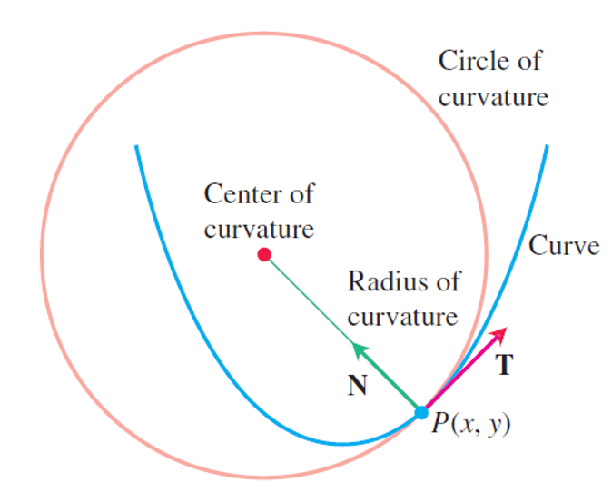

### Vector-Valued Functions and Motion in Space

The position vector $r$ is a function of time:
$$
\mathbf{r}(t)=\overrightarrow{O P}=f(t) \mathbf{i}+g(t) \mathbf{j}+h(t) \mathbf{k}
$$
velocity is the derivative of position
$$
v=\frac{dr}{dt}
$$
speed is the magnitude of velocity
$$
\text{speed} =|v|
$$
Acceleration is the derivative of velocity
$$
\mathbf{a}=\frac{d \mathbf{v}}{d t}=\frac{d^{2} \mathbf{r}}{d t^{2}}
$$

If a particle moves on a sphere, i.e.
$$
||r(t)||=c
$$
that is 
$$
f(t)^2+g(t)^2+h(t)^2=c^2 
$$
derivative both side
$$
2f(t)f'(t)+2g(t)g'(t)+2h(t)h'(t)=0
$$
hence
$$
\mathbf{r} \cdot \frac{d \mathbf{r}}{d t}=0
$$
The **length** of a smooth curve $\mathbf{r}(t)=x(t) \mathbf{i}+y(t) \mathbf{j}+z(t) \mathbf{k}$, $a\le t \le b$, is
$$
L=\int_{a}^{b} \sqrt{\left(\frac{d x}{d t}\right)^{2}+\left(\frac{d y}{d t}\right)^{2}+\left(\frac{d z}{d t}\right)^{2}} d t
$$
which is actually
$$
L=\int_{a}^{b}|\mathbf{v}| d t
$$
We find the unit tangent vector $T$ by dividing $v$ by $|v|$.

As $P$ moves along the curve in the direction of increasing arc length, the unit tangent vector turns. The value of $|dT/ds|$ at $P$ is called the **curvature** of the curve at $P​$.
$$
\kappa=\left|\frac{d \mathbf{T}}{d s}\right|
$$
Because
$$
L=\int_{a}^{b}|\mathbf{v}| d t
$$
And
$$
L=\int_{a}^{b} d s
$$
Hence
$$
\kappa=\frac{1}{|\mathbf{v}|}\left|\frac{d \mathbf{T}}{d t}\right|
$$
Since $T$ is a unit vector, 
$$
|T| \equiv 1
$$
hence
$$
\mathbf{T} \cdot \frac{d \mathbf{T}}{d t}=0
$$
So the direction of normal vector is $dT/dt$, then the principal unit normal is
$$
\mathbf{N}=\frac{d \mathbf{T} / d t}{|d \mathbf{T} / d t|}
$$

